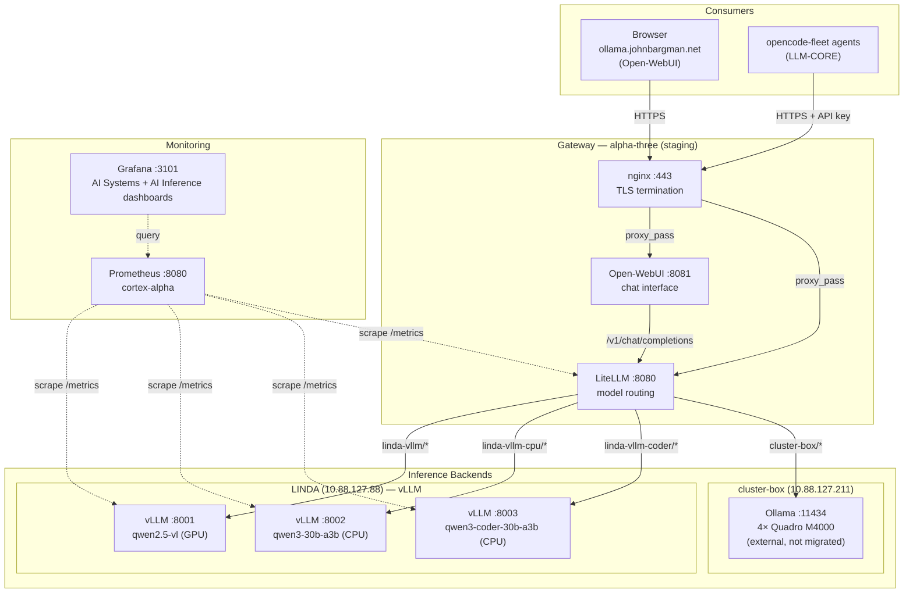

# AI Infrastructure Stack

Self-hosted LLM inference infrastructure for the Bargman-Tech fleet. Provides GPU and CPU inference through a single vLLM engine, a centralized LiteLLM gateway, and a browser-based chat interface.

**Status**: Active (vLLM-only)  
**Last updated**: 2026-08-25

---

## Architecture Overview

The fleet uses a four-layer architecture: browser UI → gateway → inference backends → hardware. Inference is served exclusively by vLLM on the NixOS-Configuration managed fleet (LINDA); each model gets its own systemd service and port, with weights managed as Nix packages in the store.



### Data Flow

```
Browser / opencode-fleet agent
    ↓ POST https://agentic-gateway.johnbargman.net/v1/chat/completions
    ↓ Authorization: Bearer <api-key>
    ↓
nginx (alpha-three, 10.88.127.107)
    ↓ TLS termination (ACME wildcard cert)
    ↓ proxy_pass http://127.0.0.1:8080
    ↓
LiteLLM (alpha-three, 127.0.0.1:8080)
    ↓ API key validation
    ↓ Route by model prefix:
    ↓   linda-vllm/*      → http://10.88.127.88:8001/v1   (qwen2.5-vl, GPU)
    ↓   linda-vllm-cpu/*  → http://10.88.127.88:8002/v1   (qwen3-30b-a3b, CPU)
    ↓   linda-vllm-coder/*→ http://10.88.127.88:8003/v1   (qwen3-coder-30b-a3b, CPU)
    ↓   cluster-box/*     → http://10.88.127.211:11434/v1 (Ollama, external)
    ↓
Inference backend (vLLM on LINDA; Ollama on cluster-box)
    ↓ GPU/CPU inference
    ↓
Response back through chain
```

---

## Components

### LiteLLM Gateway

**Location**: alpha-three (staging)  
**Port**: 8080 (localhost only)  
**External**: `agentic-gateway.johnbargman.net` (nginx TLS)  
**Package**: `unstable.litellm`  
**Config**: `services/litellm.nix`, `machines/alpha-three/default.nix`

LiteLLM provides a unified OpenAI-compatible API that routes requests to the inference backends. It handles:
- Model routing by prefix (`linda-vllm/*`, `linda-vllm-cpu/*`, `linda-vllm-coder/*`, `cluster-box/*`)
- API key authentication
- Per-backend rate limiting (rpm/tpm)
- Request timeouts and parameter dropping (e.g. Qwen3 `reasoning_effort` for CPU backends)
- Prometheus metrics on `/metrics` (`callbacks = [ "prometheus" ]`)

**Backends** (defined in `machines/alpha-three/default.nix`):

| Backend | URL | Model Type | Models | Max Tokens |
|---------|-----|------------|--------|------------|
| `linda-vllm` | `http://10.88.127.88:8001/v1` | `hosted_vllm` | qwen2.5-vl (vision, video) | 8192 |
| `linda-vllm-cpu` | `http://10.88.127.88:8002/v1` | `hosted_vllm` | qwen3-30b-a3b | 32768 |
| `linda-vllm-coder` | `http://10.88.127.88:8003/v1` | `hosted_vllm` | qwen3-coder-30b-a3b | 32768 |
| `cluster-box` | `http://10.88.127.211:11434/v1` | `openai` (Ollama /v1, external) | laguna-xs-2.1, ornith:9b, ornith:35b | — |

**Secrets**: `litellm-master` (gateway master key), `litellm-env` (database URL, etc.)

### Open-WebUI

**Location**: alpha-three (staging)  
**Port**: 8081 (localhost only)  
**External**: `ollama.johnbargman.net` (nginx TLS — legacy hostname; serves Open-WebUI, not Ollama)  
**Package**: `pkgs.open-webui` (CPU-only pytorch via `overrideScope`)  
**Config**: `services/ollama-ui.nix` (legacy filename)

Browser-based chat interface (ChatGPT-like) for testing and quick interaction. Connects to LiteLLM gateway via OpenAI-compatible API.

**Key configuration**:
- `OPENAI_API_BASE_URL = "http://127.0.0.1:8080"` — internal URL to LiteLLM (same machine)
- API key injected via secrix environment file (`open-webui-env`)

**Known issue**: open-webui pulls in sentence-transformers → pytorch, which would force a CUDA pytorch build when `cudaSupport = true` is set globally on alpha-three. Resolved by scoping pytorch to CPU-only via `python3Packages.overrideScope` (replaces the old `pkgsNoCuda` duplicate-nixpkgs workaround).

### vLLM

**Location**: LINDA (10.88.127.88)  
**Ports**: 8001 (GPU), 8002/8003 (CPU) — WireGuard accessible  
**Package**: `pkgsCuda.vllm` (GPU; separate nixpkgs_llm import with `cudaSupport`) and `pkgsCpuVllm` (CPU wrapper: `+cpu` metadata + zentorch)  
**Config**: `modules/vllm.nix`, `machines/LINDA/default.nix`

vLLM is the fleet's single inference engine — the only inference server on the managed fleet. Multi-model, with each model on its own port and systemd service. GPU-accelerated on the RTX 3060; CPU inference for the large MoE models.

**Deployed models**:

| Model | HF ID | Device | Port | Quant/DTYPE | Max Context | VRAM/RAM | Features |
|-------|-------|--------|------|-------------|-------------|----------|----------|
| `qwen2.5-vl` | `Qwen/Qwen2.5-VL-7B-Instruct-AWQ` | GPU (RTX 3060) | 8001 | AWQ | 8192 | ~5 GB VRAM | Vision, video input, prefix caching |
| `qwen38-27b` | `Qwen/Qwen3.8-27B` (nix store) | CPU | 8002 | bfloat16 | 32K | 4 GiB KV cache | Dense 27B, vision-language |
| `qwen3-coder-30b-a3b` | `Qwen/Qwen3-Coder-30B-A3B-Instruct` (nix store) | CPU | 8003 | bfloat16 | 32K | 4 GiB KV cache | MoE (3B active), code |

**Model management**:
- CPU and GPU model weights are Nix packages (`pkgs/models/*.nix`), fetched from HuggingFace with per-file SRI hashes and pinned commit SHAs, then installed to the store. vLLM loads them via `modelPath` — no runtime HuggingFace downloads.
- GPU model (qwen2.5-vl) uses `gpuMemoryUtilization = 0.8`, `--enable-prefix-caching`, `--max-num-seqs 16`.

**Module features** (`modules/vllm.nix`):
- Multi-model support (each model gets its own systemd service)
- Per-model device assignment (`gpu` / `cpu`), port allocation, and dtype
- CPU models: `VLLM_CPU_KVCACHE_SPACE`, `VLLM_CPU_OMP_THREADS_BIND`, `MemoryMax = 80%`
- GPU memory utilization control and tensor parallelism
- Security hardening (dedicated `vllm` user, `NoNewPrivileges`, `ProtectSystem=strict`)
- `PrivateTmp = false` — required for torch.compile cubin cache persistence
- Cache directory management (`/speed-storage/vllm-cache`)

**Hardware allocation**:
- RTX 3060 (GPU 0): vLLM GPU model only — `cudaVisibleDevices = "0"`
- GTX 1050 (GPU 1): Too small for inference (2GB), unused
- CPU: 30 of 48 cores pinned to each CPU model via `cpuOmpThreadsBind = "0-29"`

**Model lifecycle**: vLLM keeps models loaded for the service lifetime. It does not auto-unload on inactivity. CPU models (~55GB each) consume RAM while the service is running. Services can be stopped manually (`systemctl stop vllm-<name>`) when not needed. Future work: systemd socket activation (`vllm.socket`) to start services on demand and stop after idle timeout, eliminating permanent RAM residency.

### Ollama (Decommissioned)

**Status**: Removed from the managed fleet. LINDA's Ollama service was migrated to vLLM CPU inference and archived to `services/archive/ollama.nix`. The former CPU model lineup (qwen3.8:27b, qwen3-coder:30b, laguna-s-2.1, laguna-xs-2.1) is served by vLLM.

### cluster-box (Malayalam)

**Location**: 10.88.127.211 (WireGuard)  
**Operator**: dlyon (on-site)  
**Oversight**: John88 (architectural authority)  
**Repository**: `Malayalam` (GitLab, private)  
**Config**: Passthrough from Malayalam flake

CUDA inference machine with 4× Quadro M4000 GPUs. Operated by dlyon, consumed by NixOS-Configuration as a verbatim flake input (passthrough pattern).

**Models**: laguna-xs-2.1, ornith:9b, ornith:35b (served by Ollama — NOT migrated to vLLM)

**Integration**: See `Malayalam/documents/architecture-passthrough.md` for the passthrough pattern documentation. cluster-box is outside the NixOS-Configuration migration boundary; its inference stack is owned by the Malayalam flake.

---

## Model Inventory

### Currently Deployed

| Machine | Engine | Model Tag | Parameters | Quant/DTYPE | Context | VRAM/RAM | Status |
|---------|--------|-----------|------------|-------------|---------|----------|--------|
| LINDA | vLLM (GPU) | qwen2.5-vl (Qwen2.5-VL-7B-Instruct-AWQ) | 7B | AWQ | 8192 | ~5 GB VRAM | Active |
| LINDA | vLLM (CPU) | qwen3-30b-a3b (Qwen3-30B-A3B) | 30B MoE (3B active) | bfloat16 | 32K | 40 GiB KV cache | Active |
| LINDA | vLLM (CPU) | qwen3-coder-30b-a3b (Qwen3-Coder-30B-A3B-Instruct) | 30B MoE (3B active) | bfloat16 | 32K | 40 GiB KV cache | Active |
| cluster-box | Ollama (GPU, external) | laguna-xs-2.1:q4_K_M | 33B MoE | Q4_K_M | 256K | — | Active |
| cluster-box | Ollama (GPU, external) | ornith:9b | 9B | — | — | — | Active |
| cluster-box | Ollama (GPU, external) | ornith:35b | 35B | — | — | — | Active |

### Hardware Budget

| Machine | GPU | VRAM | CPU | RAM | Role |
|---------|-----|------|-----|-----|------|
| LINDA | RTX 3060 + GTX 1050 | 12 GB + 2 GB | AMD (48 cores) | Large | Testbed (vLLM GPU + CPU inference) |
| cluster-box | 4× Quadro M4000 | 8 GB each | i7-6850K | — | Production inference (external) |

---

## Gateway Domain

**URL**: `https://agentic-gateway.johnbargman.net`  
**DNS**: Points to alpha-three WireGuard IP (10.88.127.107)  
**TLS**: ACME wildcard cert (`*.johnbargman.net`)  
**Auth**: LiteLLM API key (Bearer token)

The domain is stable. When the gateway migrates from alpha-three to its permanent home, only the DNS record changes.

---

## Related Inputs

### LLM-CORE

**Repository**: `gitlab:mecha-team-zero/llm-core`  
**Flake input**: `LLM-CORE`  
**Purpose**: Agent fleet generation (47 agents across 6 ships)  
**Consumed as**: `services.opencode-fleet` NixOS module

LLM-CORE generates opencode agent configurations. The `opencode-fleet` module is imported by LINDA and alpha-three. It provides:
- Agent deployment to `~/.config/opencode/agents/`
- MCP server configuration (git, filesystem, time, sqlite, playwright, github, gitlab, prometheus, nix-mcp)
- Provider configuration (openrouter, opencode-go, xiaomi-token-plan-sgp, xai, litellm)

**Planned**: Migrate `fleet-data-v3.nix` (flat attribute set describing agents/models/ships) into NixOS-Configuration for single-source-of-truth control over systems, models, and consumption. Backward compatibility with LLM-CORE flake input preserved.

### Malayalam

**Repository**: `gitlab:mecha-team-zero/Malayalam` (private)  
**Flake input**: `malayalam`  
**Purpose**: cluster-box machine configuration  
**Consumed as**: Verbatim passthrough (no overrides)

Malayalam is a standalone NixOS flake owned by dlyon. NixOS-Configuration imports it verbatim — the system derivation is identical whether deployed from Malayalam (LAN) or NixOS-Configuration (WireGuard).

**Key documents**:
- `Malayalam/documents/architecture-passthrough.md` — integration pattern
- `Malayalam/documents/gateway-design-2026-07-31.md` — original gateway architecture

---

## Monitoring

### Prometheus Scrape Targets

| Job | Target | Interval | AI-Relevant |
|-----|--------|----------|-------------|
| `vllm-gpu` | 10.88.127.88:8001 (LINDA, qwen2.5-vl) | 5s | vLLM inference metrics (GPU) |
| `vllm-cpu` | 10.88.127.88:8002 (LINDA, qwen3-30b-a3b) | 5s | vLLM inference metrics (CPU) |
| `vllm-cpu-coder` | 10.88.127.88:8003 (LINDA, qwen3-coder-30b-a3b) | 5s | vLLM inference metrics (CPU) |
| `litellm` | 10.88.127.107:8080 (alpha-three) | 10s | Gateway metrics (request rate, backend health) |
| `nvidia` | LINDA, alpha-three, alpha-one, terminal-nx-01 | 5s | GPU utilization, VRAM, temperature |
| `node` | 14 machines including LINDA, alpha-three | 30s | CPU, memory, disk |
| `zfs` | LINDA, local-nas, cortex-alpha, remote-builder | 30s | Storage health |
| `smartctl` | 11 machines including LINDA, alpha-three | 60s | Disk health |
| `malayalam-node` | cluster-box (10.88.127.211:3100) | 30s | Node metrics |
| `malayalam-nvidia` | cluster-box (10.88.127.211:3103) | 10s | GPU metrics |

### vLLM Metrics

Every vLLM model exposes Prometheus metrics on its `/metrics` endpoint:

| Metric | Type | Purpose |
|--------|------|---------|
| `vllm:num_requests_running` | Gauge | Currently executing requests |
| `vllm:num_requests_waiting` | Gauge | Queue depth |
| `vllm:kv_cache_usage_perc` | Gauge | KV cache / VRAM pressure |
| `vllm:time_to_first_token_seconds` | Histogram | TTFT latency |
| `vllm:e2e_request_latency_seconds` | Histogram | End-to-end latency |
| `vllm:prompt_tokens_total` | Counter | Input throughput |
| `vllm:generation_tokens_total` | Counter | Output throughput |

### Grafana Dashboards

- **AI Systems** (`ai-systems.json`): CPU, GPU utilization, VRAM, temperature, power, fan, clocks, disk I/O, ZFS pools, SMART health across cortex-alpha, alpha-three, LINDA
- **AI Inference** (`ai-inference.json`): request rate, latency (p50/p95/p99), queue depth, KV cache usage, error rate, token throughput by model, LiteLLM gateway health

### Missing Monitoring

- No alerting rules for GPU temperature, VRAM exhaustion, queue depth, or inference failures

---

## Operational Procedures

### Adding a New Model to vLLM

1. (CPU models) Create a model package in `pkgs/models/<name>.nix` — pin each file's SRI hash and the repo commit SHA; register it in the `models` attrset in `flake.nix`
2. Edit `machines/LINDA/default.nix` — add entry to `services.vllm.models` list
3. Set port, device (`gpu`/`cpu`), maxModelLen, dtype, quantization, modelPath, extraArgs
4. Regenerate golden: `nix run .#dump-config -- LINDA | jq -S . > goldens/LINDA.json`
5. Deploy: `nix run .#LINDA -- switch`
6. Verify: `curl http://10.88.127.88:<port>/v1/models`

### Adding a New Backend to LiteLLM

1. Edit `machines/alpha-three/default.nix` — add entry to `services.litellm.backends`
2. Set url, models, modelType (`hosted_vllm` for vLLM), apiKey, maxTokens, supportsVision, additional_drop_params, etc.
3. Regenerate golden: `nix run .#dump-config -- alpha-three | jq -S . > goldens/alpha-three.json`
4. Deploy: `nix run .#alpha-three -- switch`
5. Verify: `curl -s https://agentic-gateway.johnbargman.net/v1/models -H "Authorization: Bearer <key>"`

### Adding a Prometheus Scrape Target for a New Model

1. Edit `services/prometheus.nix` — add a job for the new model's port (e.g. `vllm-cpu-<name>`), with labels `hostname`, `device`, `model`
2. Regenerate golden: `nix run .#dump-config -- cortex-alpha | jq -S . > goldens/cortex-alpha.json`
3. Deploy: `nix run .#cortex-alpha -- switch`
4. Verify: query `vllm:num_requests_waiting{model="<name>"}` in Prometheus

### Testing the Gateway

```bash
# List available models
curl -s https://agentic-gateway.johnbargman.net/v1/models \
  -H "Authorization: Bearer <api-key>" | jq .

# Chat completion
curl -X POST https://agentic-gateway.johnbargman.net/v1/chat/completions \
  -H "Content-Type: application/json" \
  -H "Authorization: Bearer <api-key>" \
  -d '{
    "model": "linda-vllm-cpu/qwen3-30b-a3b",
    "messages": [{"role": "user", "content": "Hello"}]
  }'
```

### Checking Service Status

```bash
# LINDA — vLLM GPU (qwen2.5-vl)
ssh -p 1108 inspect@10.88.127.88 "systemctl status vllm-qwen2.5-vl"

# LINDA — vLLM CPU (qwen3-30b-a3b)
ssh -p 1108 inspect@10.88.127.88 "systemctl status vllm-qwen3-30b-a3b"

# LINDA — vLLM CPU coder (qwen3-coder-30b-a3b)
ssh -p 1108 inspect@10.88.127.88 "systemctl status vllm-qwen3-coder-30b-a3b"

# alpha-three — LiteLLM
ssh -p 1108 inspect@10.88.127.107 "systemctl status litellm"

# alpha-three — Open-WebUI
ssh -p 1108 inspect@10.88.127.107 "systemctl status open-webui"
```

---

## Capacity Planning

### LINDA (Testbed)

**GPU (RTX 3060, 12 GB VRAM)**:
- vLLM with Qwen2.5-VL-7B-AWQ: ~5 GB VRAM (`gpuMemoryUtilization = 0.8`)
- Remaining ~7 GB: available for additional models or larger context
- Sweet spot: 7-14B dense models at Q4/Q8 quantization
- 33B MoE models (Laguna, Qwen3-30B-A3B) do NOT fit — they run on CPU via vLLM

**CPU + RAM**:
- vLLM CPU models (qwen3-30b-a3b, qwen3-coder-30b-a3b) run concurrently, each with 40 GiB KV cache in bfloat16
- `MemoryMax = 80%` on each CPU service caps host RAM usage
- `cpuOmpThreadsBind = "0-29"` pins OpenMP threads to 30 of 48 cores (reserves headroom for the desktop environment and GPU model)

**Risk**: Two CPU models at 40 GiB KV cache each plus weights can approach the host RAM ceiling; `MemoryMax` is the safeguard but OOM-killer pressure is possible under sustained load.

### cluster-box (Production, external)

**GPU (4× Quadro M4000, 8 GB each)**:
- Ollama handles GPU/CPU hybrid inference (unchanged — external Malayalam flake)
- Laguna XS 2.1 (33B MoE) fits with CPU offloading
- Multiple models can run across GPUs

---

## Current Limitations

1. **vLLM CPU performance**: CPU inference (Qwen3-30B-A3B) is usable but slower than GPU. Benchmarking against the old Ollama CPU setup was not completed before decommissioning; a GPU upgrade on LINDA would benefit the CPU-bound models.

2. **cluster-box not migrated**: cluster-box still runs Ollama (external Malayalam flake). Its models (laguna-xs-2.1, ornith) are outside the NixOS-Configuration migration boundary. Migration requires coordination with the Malayalam owner (dlyon) or replacing the passthrough.

3. **Laguna models unavailable on HuggingFace**: laguna-s/laguna-xs are custom GGUF models. They were NOT migrated to vLLM (no HF safetensors release). Flagged for review — options: keep on cluster-box, convert GGUF→HF, or replace with Qwen3-30B-A3B.

4. **No alerting rules**: Prometheus scrapes all inference services, but there are no alerting rules for GPU temperature, VRAM exhaustion, KV cache pressure, queue depth, or gateway health.

5. **Gateway is staging**: alpha-three is a staging system. The gateway will migrate to a permanent home (possibly off-site). Configuration is declarative — only DNS changes.

6. **LiteLLM on unstable**: The gateway depends on `unstable.litellm`. A breaking change in nixpkgs-unstable could take down the fleet LLM gateway.

7. **Legacy naming**: The chat UI vhost (`ollama.johnbargman.net`) and the `services/ollama-ui.nix` filename retain the Ollama-era naming although they now serve Open-WebUI/vLLM. Renaming is cosmetic and deferred.

---

## Future Expansion

- **Gateway migration**: Move gateway from alpha-three to permanent off-site server
- **Fleet data migration**: Move `fleet-data-v3.nix` into NixOS-Configuration for single-source-of-truth model/system management
- **cluster-box migration**: Migrate cluster-box inference from Ollama to vLLM (coordinate with Malayalam/dlyon)
- **Laguna model resolution**: Convert custom GGUF models to HuggingFace format or replace with HF-available equivalents
- **Alerting**: GPU temperature, VRAM exhaustion, KV cache pressure, queue depth, inference latency, gateway health
- **Additional backends**: pillar-of-autum, dlyon-PC (provisioning)
- **genWireguard migration**: Move WireGuard config into topology generator pipeline (overlord-iii)

---

## File Reference

| File | Purpose |
|------|---------|
| `modules/vllm.nix` | vLLM NixOS module (multi-model, device assignment, security hardening) |
| `pkgs/models/default.nix` | HuggingFace model package template (per-file SRI hashes, pinned revisions) |
| `pkgs/models/qwen3-30b-a3b.nix` | Qwen3-30B-A3B model package (CPU workhorse) |
| `pkgs/models/qwen3-coder-30b-a3b.nix` | Qwen3-Coder-30B-A3B-Instruct model package |
| `pkgs/models/qwen3-8b.nix` | Qwen3-8B model package (reference/small-model example) |
| `services/litellm.nix` | LiteLLM gateway module (backend routing, API key auth, metrics) |
| `services/ollama-ui.nix` | Open-WebUI configuration (browser chat interface; legacy filename) |
| `services/archive/ollama.nix` | Archived Ollama service configuration (decommissioned) |
| `services/prometheus.nix` | Prometheus + Grafana configuration (vLLM/LiteLLM scrape targets) |
| `services/graphana_dashboards/ai-systems.json` | AI Systems Grafana dashboard (hardware) |
| `services/graphana_dashboards/ai-inference.json` | AI Inference Grafana dashboard (vLLM/LiteLLM metrics) |
| `machines/LINDA/default.nix` | LINDA machine config (vLLM GPU + CPU models) |
| `machines/alpha-three/default.nix` | alpha-three machine config (LiteLLM, Open-WebUI) |
| `topology/LINDA.json` | LINDA topology (WireGuard, firewall, backup) |
| `topology/alpha-three.json` | alpha-three topology (vhosts, firewall) |
