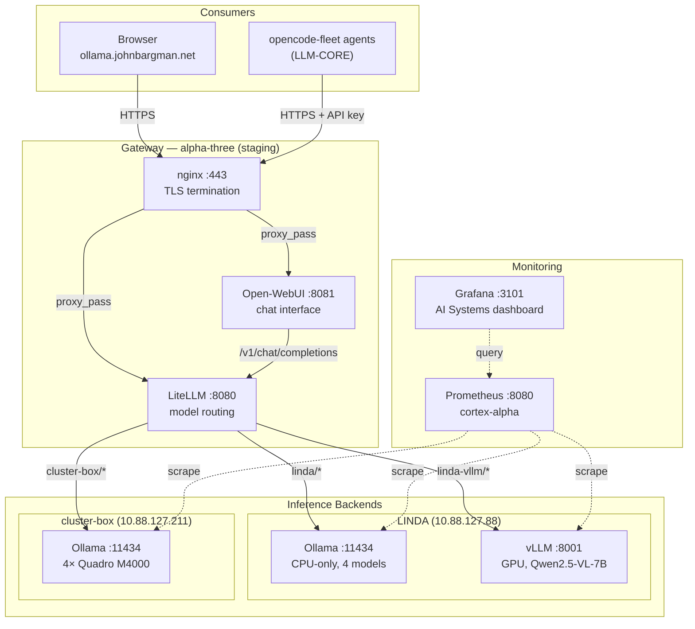

# AI Infrastructure Stack

Self-hosted LLM inference infrastructure for the Bargman-Tech fleet. Provides GPU and CPU inference, a centralized gateway, and a browser-based chat interface.

**Status**: Active (testbed phase)  
**Last updated**: 2026-08-24

---

## Architecture Overview

The fleet uses a four-layer architecture: browser UI → gateway → inference backends → hardware.



### Data Flow

```
Browser / opencode-fleet agent
    ↓ POST https://agentic-gateway.johnbargman.net/v1/chat/completions
    ↓ Authorization: Bearer <api-key>
    ↓
nginx (alpha-three, 10.88.127.107)
    ↓ TLS termination (ACME wildcard cert)
    ↓ proxy_pass http://127.0.0.1:8080
    ↓
LiteLLM (alpha-three, 127.0.0.1:8080)
    ↓ API key validation
    ↓ Route by model prefix:
    ↓   linda/*        → http://10.88.127.88:11434/v1
    ↓   linda-vllm/*   → http://10.88.127.88:8001/v1
    ↓   cluster-box/*  → http://10.88.127.211:11434/v1
    ↓
Inference backend (Ollama or vLLM)
    ↓ GPU/CPU inference
    ↓
Response back through chain
```

---

## Components

### LiteLLM Gateway

**Location**: alpha-three (staging)  
**Port**: 8080 (localhost only)  
**External**: `agentic-gateway.johnbargman.net` (nginx TLS)  
**Package**: `unstable.litellm`  
**Config**: `services/litellm.nix`, `machines/alpha-three/default.nix`

LiteLLM provides a unified OpenAI-compatible API that routes requests to multiple inference backends. It handles:
- Model routing by prefix (`linda/*`, `cluster-box/*`, `linda-vllm/*`)
- API key authentication
- Per-backend rate limiting (rpm/tpm)
- Request timeouts
- Parameter dropping for incompatible backends

**Backends** (defined in `machines/alpha-three/default.nix`):

| Backend | URL | Model Type | Models |
|---------|-----|------------|--------|
| `linda` | `http://10.88.127.88:11434/v1` | `openai` (Ollama /v1) | qwen3.8:27b, qwen3-coder:30b, laguna-s-2.1, laguna-xs-2.1 |
| `linda-vllm` | `http://10.88.127.88:8001/v1` | `hosted_vllm` | qwen2.5-vl (vision) |
| `cluster-box` | `http://10.88.127.211:11434/v1` | `openai` (Ollama /v1) | laguna-xs-2.1, ornith:9b, ornith:35b |

**Secrets**: `litellm-master` (gateway master key), `litellm-env` (database URL, etc.)

### Open-WebUI

**Location**: alpha-three (staging)  
**Port**: 8081 (localhost only)  
**External**: `ollama.johnbargman.net` (nginx TLS)  
**Package**: `pkgsNoCuda.open-webui` (CPU-only, avoids pytorch CUDA build)  
**Config**: `services/ollama-ui.nix`

Browser-based chat interface (ChatGPT-like) for testing and quick interaction. Connects to LiteLLM gateway via OpenAI-compatible API.

**Key configuration**:
- `OPENAI_API_BASE_URL = "http://127.0.0.1:8080"` — internal URL to LiteLLM (same machine)
- API key injected via secrix environment file (`open-webui-env`)

**Known issue**: The `pkgsNoCuda` import creates a separate nixpkgs instance without CUDA to avoid building pytorch from source. This is a workaround for open-webui pulling in sentence-transformers → pytorch when `cudaSupport = true`.

### Ollama

**Location**: LINDA (10.88.127.88)  
**Port**: 11434 (WireGuard accessible)  
**Package**: `pkgs_llm.ollama-cpu` (pinned to CPU-only build)  
**Config**: `services/ollama.nix`

CPU-only inference server for large models. GPU is reserved exclusively for vLLM.

**Runtime configuration**:
- `OLLAMA_CONTEXT_LENGTH = "262144"` — 256K native context (all models verified via `/api/show`)
- `OLLAMA_KV_CACHE_TYPE = "q4_0"` — quantized KV cache (~15-16 GiB/model instead of ~40 GiB at f16)

**Pre-loaded models** (defined in `services/ollama.nix`):

| Model Tag | Size | Quantization | Context | Purpose |
|-----------|------|--------------|---------|---------|
| `qwen3.8:27b-q4_K_M` | 27B | Q4_K_M | 256K | General purpose |
| `qwen3-coder:30b-a3b-q4_K_M` | 30B (MoE) | Q4_K_M | 256K | Code generation |
| `laguna-s-2.1:q4_K_M` | 33B (MoE) | Q4_K_M | 256K | General purpose |
| `laguna-xs-2.1:q4_K_M` | 33B (MoE) | Q4_K_M | 256K | Lightweight Laguna |

**Note**: All four models are 256K-native. The `q4_0` KV cache type makes the full window affordable on CPU. Sampling parameters are baked into each model's `PARAMETER` block and take precedence over environment defaults.

### vLLM

**Location**: LINDA (10.88.127.88)  
**Port**: 8001 (WireGuard accessible)  
**Package**: `pkgs_llm.vllm` (from nixpkgs_llm, unstable)  
**Config**: `modules/vllm.nix`, `machines/LINDA/default.nix`

GPU-accelerated inference server with OpenAI-compatible API. Dedicated to RTX 3060 (12GB VRAM).

**Deployed model**:

| Model | HF ID | Quantization | Max Context | VRAM | Features |
|-------|-------|--------------|-------------|------|----------|
| `qwen2.5-vl` | `Qwen/Qwen2.5-VL-7B-Instruct-AWQ` | AWQ | 8192 | ~5GB | Vision, video input |

**Module features** (`modules/vllm.nix`):
- Multi-model support (each model gets its own systemd service)
- Per-model port allocation
- GPU memory utilization control
- Tensor parallelism (for multi-GPU setups)
- Security hardening (dedicated `vllm` user, `NoNewPrivileges`, `ProtectSystem=strict`)
- `PrivateTmp = false` — required for torch.compile cubin cache persistence
- Cache directory management (`/speed-storage/vllm-cache`)

**Hardware allocation**:
- RTX 3060 (GPU 0): vLLM only — `cudaVisibleDevices = "0"`
- GTX 1050 (GPU 1): Too small for inference (2GB), unused

### cluster-box (Malayalam)

**Location**: 10.88.127.211 (WireGuard)  
**Operator**: dlyon (on-site)  
**Oversight**: John88 (architectural authority)  
**Repository**: `Malayalam` (GitLab, private)  
**Config**: Passthrough from Malayalam flake

CUDA inference machine with 4× Quadro M4000 GPUs. Operated by dlyon, consumed by NixOS-Configuration as a verbatim flake input (passthrough pattern).

**Models**: laguna-xs-2.1, ornith:9b, ornith:35b

**Integration**: See `Malayalam/documents/architecture-passthrough.md` for the passthrough pattern documentation.

---

## Model Inventory

### Currently Deployed

| Machine | Engine | Model Tag | Parameters | Quant | Context | VRAM/RAM | Status |
|---------|--------|-----------|------------|-------|---------|----------|--------|
| LINDA | Ollama (CPU) | qwen3.8:27b-q4_K_M | 27B | Q4_K_M | 256K | ~16 GiB KV | Active |
| LINDA | Ollama (CPU) | qwen3-coder:30b-a3b-q4_K_M | 30B MoE | Q4_K_M | 256K | ~16 GiB KV | Active |
| LINDA | Ollama (CPU) | laguna-s-2.1:q4_K_M | 33B MoE | Q4_K_M | 256K | ~16 GiB KV | Active |
| LINDA | Ollama (CPU) | laguna-xs-2.1:q4_K_M | 33B MoE | Q4_K_M | 256K | ~16 GiB KV | Active |
| LINDA | vLLM (GPU) | qwen2.5-vl (Qwen2.5-VL-7B-Instruct-AWQ) | 7B | AWQ | 8192 | ~5 GB | Active |
| cluster-box | Ollama (GPU) | laguna-xs-2.1:q4_K_M | 33B MoE | Q4_K_M | 256K | — | Active |
| cluster-box | Ollama (GPU) | ornith:9b | 9B | — | — | — | Active |
| cluster-box | Ollama (GPU) | ornith:35b | 35B | — | — | — | Active |

### Hardware Budget

| Machine | GPU | VRAM | CPU | RAM | Role |
|---------|-----|------|-----|-----|------|
| LINDA | RTX 3060 + GTX 1050 | 12 GB + 2 GB | AMD (30 cores) | Large | Testbed (CPU + GPU inference) |
| cluster-box | 4× Quadro M4000 | 8 GB each | i7-6850K | — | Production inference |

---

## Gateway Domain

**URL**: `https://agentic-gateway.johnbargman.net`  
**DNS**: Points to alpha-three WireGuard IP (10.88.127.107)  
**TLS**: ACME wildcard cert (`*.johnbargman.net`)  
**Auth**: LiteLLM API key (Bearer token)

The domain is stable. When the gateway migrates from alpha-three to its permanent home, only the DNS record changes.

---

## Related Inputs

### LLM-CORE

**Repository**: `gitlab:mecha-team-zero/llm-core`  
**Flake input**: `LLM-CORE`  
**Purpose**: Agent fleet generation (47 agents across 6 ships)  
**Consumed as**: `services.opencode-fleet` NixOS module

LLM-CORE generates opencode agent configurations. The `opencode-fleet` module is imported by LINDA and alpha-three. It provides:
- Agent deployment to `~/.config/opencode/agents/`
- MCP server configuration (git, filesystem, time, sqlite, playwright, github, gitlab, prometheus, nix-mcp)
- Provider configuration (openrouter, opencode-go, xiaomi-token-plan-sgp, xai, litellm)

**Planned**: Migrate `fleet-data-v3.nix` (flat attribute set describing agents/models/ships) into NixOS-Configuration for single-source-of-truth control over systems, models, and consumption. Backward compatibility with LLM-CORE flake input preserved.

### Malayalam

**Repository**: `gitlab:mecha-team-zero/Malayalam` (private)  
**Flake input**: `malayalam`  
**Purpose**: cluster-box machine configuration  
**Consumed as**: Verbatim passthrough (no overrides)

Malayalam is a standalone NixOS flake owned by dlyon. NixOS-Configuration imports it verbatim — the system derivation is identical whether deployed from Malayalam (LAN) or NixOS-Configuration (WireGuard).

**Key documents**:
- `Malayalam/documents/architecture-passthrough.md` — integration pattern
- `Malayalam/documents/gateway-design-2026-07-31.md` — original gateway architecture

---

## Monitoring

### Prometheus Scrape Targets

| Job | Target | Interval | AI-Relevant |
|-----|--------|----------|-------------|
| `nvidia` | LINDA, alpha-three, alpha-one, terminal-nx-01 | 5s | GPU utilization, VRAM, temperature |
| `node` | 14 machines including LINDA, alpha-three | 30s | CPU, memory, disk |
| `zfs` | LINDA, local-nas, cortex-alpha, remote-builder | 30s | Storage health |
| `smartctl` | 11 machines including LINDA, alpha-three | 60s | Disk health |
| `malayalam-node` | cluster-box (10.88.127.211:3100) | 30s | Node metrics |
| `malayalam-nvidia` | cluster-box (10.88.127.211:3103) | 10s | GPU metrics |

### Grafana Dashboards

- **AI Systems** (`ai-systems.json`): CPU, GPU utilization, VRAM, temperature, power, fan, clocks, disk I/O, ZFS pools, SMART health across cortex-alpha, alpha-three, LINDA

### Missing Monitoring

- No Ollama metrics endpoint scraped (`/metrics` on port 11434)
- No vLLM metrics endpoint scraped
- No LiteLLM metrics endpoint scraped
- No alerting rules for GPU temperature, VRAM exhaustion, or inference failures

---

## Operational Procedures

### Adding a New Model to Ollama

1. Edit `services/ollama.nix` — add model tag to `loadModels` list
2. Regenerate golden: `nix run .#dump-config -- LINDA | jq -S . > goldens/LINDA.json`
3. Deploy: `nix run .#LINDA -- switch`
4. Verify: `ssh -p 1108 inspect@10.88.127.88 "ollama list"`

### Adding a New Model to vLLM

1. Edit `machines/LINDA/default.nix` — add entry to `services.vllm.models` list
2. Set port, maxModelLen, quantization, extraArgs
3. Regenerate golden: `nix run .#dump-config -- LINDA | jq -S . > goldens/LINDA.json`
4. Deploy: `nix run .#LINDA -- switch`
5. Verify: `curl http://10.88.127.88:8001/v1/models`

### Adding a New Backend to LiteLLM

1. Edit `machines/alpha-three/default.nix` — add entry to `services.litellm.backends`
2. Set url, models, modelType, apiKey, maxTokens, supportsVision, etc.
3. Regenerate golden: `nix run .#dump-config -- alpha-three | jq -S . > goldens/alpha-three.json`
4. Deploy: `nix run .#alpha-three -- switch`
5. Verify: `curl -s https://agentic-gateway.johnbargman.net/v1/models -H "Authorization: Bearer <key>"`

### Testing the Gateway

```bash
# List available models
curl -s https://agentic-gateway.johnbargman.net/v1/models \
  -H "Authorization: Bearer <api-key>" | jq .

# Chat completion
curl -X POST https://agentic-gateway.johnbargman.net/v1/chat/completions \
  -H "Content-Type: application/json" \
  -H "Authorization: Bearer <api-key>" \
  -d '{
    "model": "linda/qwen3.8:27b-q4_K_M",
    "messages": [{"role": "user", "content": "Hello"}]
  }'
```

### Checking Service Status

```bash
# LINDA — Ollama
ssh -p 1108 inspect@10.88.127.88 "systemctl status ollama"

# LINDA — vLLM
ssh -p 1108 inspect@10.88.127.88 "systemctl status vllm-qwen2.5-vl"

# alpha-three — LiteLLM
ssh -p 1108 inspect@10.88.127.107 "systemctl status litellm"

# alpha-three — Open-WebUI
ssh -p 1108 inspect@10.88.127.107 "systemctl status open-webui"
```

---

## Capacity Planning

### LINDA (Testbed)

**GPU (RTX 3060, 12 GB VRAM)**:
- vLLM with Qwen2.5-VL-7B-AWQ: ~5 GB VRAM
- Remaining ~7 GB: available for additional models or larger context
- Sweet spot: 7-14B dense models at Q4/Q8 quantization
- 33B MoE models (Laguna) do NOT fit — must use CPU (Ollama)

**CPU + RAM**:
- Ollama with 4 models at 256K context, q4_0 KV cache: ~64 GiB KV cache total
- Each model loads ~15-16 GiB KV at q4_0 (vs ~40 GiB at f16)
- Actual model weights are offloaded to CPU RAM as needed
- No `MemoryMax` set on Ollama service — relies on OOM killer

**Risk**: Loading all 4 models simultaneously with 256K context can exhaust RAM. No safeguards prevent multi-model loading.

### cluster-box (Production)

**GPU (4× Quadro M4000, 8 GB each)**:
- Ollama handles GPU/CPU hybrid inference
- Laguna XS 2.1 (33B MoE) fits with CPU offloading
- Multiple models can run across GPUs

---

## Current Limitations

1. **No multi-model safeguards**: Both Ollama and vLLM can load multiple models simultaneously. No request buffering or single-model-per-device enforcement. RAM/VRAM exhaustion is possible.

2. **No inference monitoring**: No Prometheus exporters for Ollama, vLLM, or LiteLLM metrics. No alerting on GPU temperature, VRAM exhaustion, or inference failures.

3. **Gateway is staging**: alpha-three is a staging system. The gateway will migrate to a permanent home (possibly off-site). Configuration is declarative — only DNS changes.

4. **LiteLLM on unstable**: The gateway depends on `unstable.litellm`. A breaking change in nixpkgs-unstable could take down the fleet LLM gateway.

5. **Open-WebUI pytorch workaround**: The `pkgsNoCuda` import avoids building pytorch from source. This is a workaround, not a solution.

---

## Future Expansion

- **Gateway migration**: Move gateway from alpha-three to permanent off-site server
- **Fleet data migration**: Move `fleet-data-v3.nix` into NixOS-Configuration for single-source-of-truth model/system management
- **Single-model-per-device**: Enforce one model per GPU device to prevent VRAM exhaustion
- **Inference monitoring**: Add Prometheus exporters for Ollama, vLLM, LiteLLM
- **Alerting**: GPU temperature, VRAM exhaustion, inference latency, gateway health
- **Additional backends**: pillar-of-autum, dlyon-PC (provisioning)
- **genWireguard migration**: Move WireGuard config into topology generator pipeline (overlord-iii)

---

## File Reference

| File | Purpose |
|------|---------|
| `modules/vllm.nix` | vLLM NixOS module (multi-model, security hardening) |
| `services/ollama.nix` | Ollama service configuration (CPU-only, model loading) |
| `services/litellm.nix` | LiteLLM gateway module (backend routing, API key auth) |
| `services/ollama-ui.nix` | Open-WebUI configuration (browser chat interface) |
| `services/prometheus.nix` | Prometheus + Grafana configuration |
| `services/graphana_dashboards/ai-systems.json` | AI Systems Grafana dashboard |
| `machines/LINDA/default.nix` | LINDA machine config (vLLM, Ollama, GPU) |
| `machines/alpha-three/default.nix` | alpha-three machine config (LiteLLM, Open-WebUI) |
| `topology/LINDA.json` | LINDA topology (WireGuard, firewall, backup) |
| `topology/alpha-three.json` | alpha-three topology (vhosts, firewall) |
