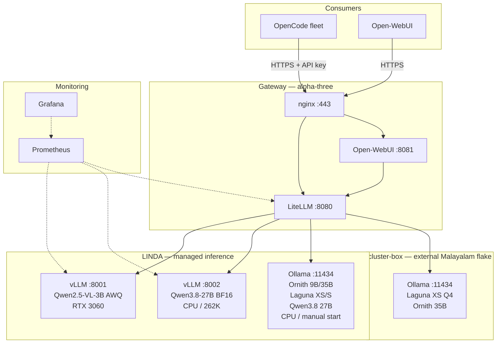

# AI Infrastructure Stack

Self-hosted inference for the Bargman-Tech fleet, using vLLM and Ollama for
different operational roles behind one LiteLLM gateway.

**Status**: Hybrid vLLM + Ollama configuration implemented; live validation complete  
**Last updated**: 2026-09-03

The evidence and decision behind this architecture are recorded in
[`ai-inference-findings.md`](ai-inference-findings.md). The prior vLLM-only
migration remains documented in
[`vllm-architecture.md`](vllm-architecture.md) as a historical implementation
record.

## Architecture



## Engine Responsibilities

### vLLM: managed services

vLLM is used when a model has a deliberate, long-running service contract:

- one systemd unit and port per model;
- explicit CPU or GPU assignment;
- explicit context and KV-cache allocation;
- native scheduling and request queuing;
- Prometheus metrics per service;
- Nix-managed, revision-pinned model weights.

This service isolation remains the correct architecture. The operational
correction is to start CPU development with a small model whose complete memory
budget is known, rather than using a 27B or 30B service as the first iteration.

### Ollama: research lifecycle

Ollama is used when the desired lifecycle is load, generate, and release:

- GGUF and custom Modelfile compatibility;
- rapid switching between research models;
- proven behavior with Ornith and Laguna;
- resource release by model expiry or stopping the daemon.

LINDA's Ollama daemon is CPU-only and manual-start. It is limited to one loaded
model, one parallel request, and 80 GiB total service memory. It does not compete
with vLLM for the RTX 3060.

### LiteLLM: routing and client contract

LiteLLM remains the authenticated OpenAI-compatible gateway on alpha-three.
Every managed backend publishes separate input/context and output limits.

`max_tokens` is not used as a context-window declaration or as a supposed clamp.
A client-supplied value overrides a deployment default. vLLM's
`--max-model-len` remains the final total-sequence guard.

The module asserts that an advertised output limit is smaller than its input
limit whenever both are set, preventing recurrence of the zero-input-space
configuration.

## Active Gateway Routes

| Public model ID | Backend | Engine | Device | Context metadata | Output metadata |
|---|---|---|---|---:|---:|
| `linda-vllm/qwen2.5-vl` | `10.88.127.88:8001/v1` | vLLM | RTX 3060 | 8192 | 2048 |
| `linda-vllm-cpu/qwen38-27b` | `10.88.127.88:8002/v1` | vLLM | CPU | 262144 | 8192 |
| `linda-ornith9/linda-ornith9-q4-256k` | `10.88.127.88:11434/v1` | Ollama | CPU | 262144 | 8192 |
| `linda-ornith35/linda-ornith35-q4-256k` | `10.88.127.88:11434/v1` | Ollama | CPU | 262144 | 8192 |
| `linda-laguna-xs/linda-laguna-xs-q4-256k` | `10.88.127.88:11434/v1` | Ollama | CPU | 262144 | 8192 |
| `linda-laguna-xs-bf16/linda-laguna-xs-bf16-256k` | `10.88.127.88:11434/v1` | Ollama | CPU | 262144 | 8192 |
| `linda-laguna-s/linda-laguna-s-q4-256k` | `10.88.127.88:11434/v1` | Ollama | CPU | 262144 | 8192 |
| `linda-qwen38/linda-qwen38-27b-q4-256k` | `10.88.127.88:11434/v1` | Ollama | CPU | 262144 | 8192 |
| `cluster-box-laguna-xs/laguna-xs-2.1:q4_K_M` | `10.88.127.211:11434/v1` | Ollama | external | 262144 | 8192 |
| `cluster-box-ornith35/ornith:35b` | `10.88.127.211:11434/v1` | Ollama | external | 262144 | 8192 |

The gateway is externally available at:

```text
https://agentic-gateway.johnbargman.net
```

nginx terminates TLS and proxies to LiteLLM on `127.0.0.1:8080`.

## LINDA vLLM Services

### GPU service: Qwen2.5-VL-3B AWQ

| Property | Value |
|---|---|
| Unit | `vllm-qwen2.5-vl.service` |
| API | `0.0.0.0:8001` |
| Device | RTX 3060, `CUDA_VISIBLE_DEVICES=0` |
| Model | `Qwen/Qwen2.5-VL-3B-Instruct-AWQ` |
| Model path | `self.models.qwen25-vl-3b-instruct-awq` |
| Maximum sequence | 8192 tokens |
| Gateway output budget | 2048 tokens |
| Tool parser | Hermes |

The 2048-token completion budget reserves prompt space and directly addresses
the OpenCode failure where an 8192-token completion was requested inside an
8192-token total sequence.

### CPU service: Qwen3.8-27B BF16

| Property | Value |
|---|---|
| Unit | `vllm-qwen38-27b.service` |
| API | `0.0.0.0:8002` |
| Device | CPU |
| Model | `Qwen/Qwen3.8-27B` |
| Maximum sequence | 262144 tokens |
| CPU KV allocation | 20 GiB |
| Gateway output budget | 8192 tokens |
| Tool parser | qwen3_xml |
| Reasoning parser | qwen3 |

The previous large Qwen3.8-27B and Qwen3-Coder services are no longer active on
LINDA. Their Nix model packages and vLLM module support remain available for a
future long-running workload with a justified startup and memory budget.

## LINDA Ollama Service

Configuration: `services/ollama.nix`

| Property | Value |
|---|---|
| Unit | `ollama.service` |
| API | `10.88.127.88:11434`, WireGuard firewall only |
| Package | `pkgs_llm.ollama-cpu` |
| Model storage | `/speed-storage/ollama` |
| Declared models | `ornith:9b`, `ornith:35b`, `laguna-xs-2.1:q4_K_M`, `laguna-xs-2.1:bf16`, `laguna-s-2.1:q4_K_M`, `qwen3.8:27b` |
| Created tags | `linda-ornith9-q4-256k`, `linda-ornith35-q4-256k`, `linda-laguna-xs-q4-256k`, `linda-laguna-xs-bf16-256k`, `linda-laguna-s-q4-256k`, `linda-qwen38-27b-q4-256k` |
| Context default | 262144 |
| Loaded model limit | 1 |
| Parallel request limit | 1 |
| Memory limit | 96 GiB |
| Boot behavior | manual; no daemon or loader `wantedBy` target |

`loadModels` synchronizes model blobs; it does not load inference weights into
RAM. Both the model-loader and daemon have their boot targets removed so model
pulls and service startup remain operator actions.

### Operations

```bash
# Start the daemon when LINDA is available for research
systemctl start ollama

# Synchronize declared model blobs
systemctl start ollama-model-loader

# Materialise created tags (FROM + num_ctx)
systemctl start ollama-create-profiles

# Release all Ollama inference memory
systemctl stop ollama
```

Starting and stopping this service is an intentional lifecycle operation. System
configuration changes still proceed through Nix rebuild and deployment.

### Benchmark Results — 2026-09-03

All models tested through LiteLLM gateway on alpha-three. Cold start = model
unloaded, then first request. Warm = immediate second request while loaded.

| Model | Size | Cold Start | Warm | Notes |
|---|---|---|---|---|
| linda-laguna-s (Q4_K_M) | 96 GB | 279.8s (4.7 min) | 2.8s | Largest model; cold start dominated by disk load |
| linda-laguna-xs (Q4_K_M) | 20 GB | 41.8s | 1.0s | Fastest warm response |
| linda-laguna-xs-bf16 | 67 GB | 62.5s | 2.0s | BF16 quantization; 3x size of Q4 |
| linda-ornith35 (Q4_K_M) | 21 GB | 36.8s | 1.6s | 35B params, Q4 quantization |
| linda-ornith9 (Q4_K_M) | 5.6 GB | 18.3s | 2.3s | Smallest model; fastest cold start |
| linda-qwen38 (Q4_K_M) | 18 GB | 36.6s | 3.5s | 27B params; vision + text |

**Key findings:**
- Cold start correlates linearly with model size (disk → RAM load time)
- Warm responses are consistently 1–3.5s regardless of model size
- All models tested via `nix run .#llm-bench` (detached tmux session)
- Results logged to `/tmp/llm-bench-<timestamp>.log` for Prometheus correlation

## OpenCode and Context Limits

The gateway metadata must preserve three different concepts:

| Layer | Field | Meaning |
|---|---|---|
| vLLM | `--max-model-len` | Total prompt plus completion sequence |
| LiteLLM | `model_info.max_input_tokens` | Context/input limit discovered by clients |
| LiteLLM | `model_info.max_output_tokens` | Maximum completion discovered by clients |
| OpenCode | `limit.context` | Conversation context budget |
| OpenCode | `limit.output` | Completion request sent to the provider |

For the GPU model, OpenCode should discover context 8192 and output 2048. Its
compaction logic then reserves completion space instead of requesting an
8192-token response with no room left for the prompt.

A build can validate the generated LiteLLM model list, but a successful harness
completion requires deployment and a live request. That live gate remains open.

## Monitoring

Prometheus scrapes:

| Job | Target | Labels |
|---|---|---|
| `vllm-gpu` | `10.88.127.88:8001` | `LINDA`, `gpu`, `qwen2.5-vl` |
| `vllm-cpu` | `10.88.127.88:8002` | `LINDA`, `cpu`, `qwen38-27b` |
| `litellm` | `10.88.127.107:8080` | `alpha-three`, `gateway` |

The inactive large-model port 8003 scrape has been removed. Ollama does not
provide vLLM-equivalent native metrics; node-level memory and CPU metrics remain
available for its 96 GiB service envelope.

Grafana dashboards:

- `services/graphana_dashboards/ai-systems.json`
- `services/graphana_dashboards/ai-inference.json`

## Declarative Validation

```bash
nix run .#validate-goldens --option builders '' -- LINDA
nix run .#validate-goldens --option builders '' -- alpha-three
nix run .#validate-goldens --option builders '' -- cortex-alpha
nix flake check --option builders ''
nix build .#nixosConfigurations.LINDA.config.system.build.toplevel \
  --no-link --print-out-paths --option builders ''
```

Goldens change here because the service and routing configuration change is
intentional. They are not regenerated to conceal refactoring differences.

## Key Files

| File | Purpose |
|---|---|
| `documentation/ai-inference-findings.md` | Usage findings and accepted forward design |
| `modules/vllm.nix` | Per-model vLLM service module |
| `services/ollama.nix` | CPU-only, manual LINDA research service |
| `services/litellm.nix` | Gateway backend schema and generated model metadata |
| `machines/LINDA/default.nix` | Active GPU and CPU vLLM services |
| `machines/alpha-three/default.nix` | Gateway route declarations |
| `services/prometheus.nix` | Inference and gateway scrape targets |
| `topology/LINDA.json` | WireGuard-scoped Ollama firewall port |
| `scripts/llm-bench.sh` | Benchmark script for cold/warm timing measurements |

## Related Systems

- **LLM-CORE** generates and deploys the OpenCode agent fleet. It selects gateway
  model IDs but does not currently define token limits.
- **Malayalam** owns cluster-box and remains an external passthrough flake.
- **Open-WebUI** runs on alpha-three and reaches the same LiteLLM gateway.

## Remaining Live Gates

1. Deploy LINDA and alpha-three.
2. Confirm both vLLM `/v1/models` endpoints.
3. Run an OpenCode harness through `linda-vllm/qwen2.5-vl` and record a non-empty
   completion.
4. Exercise a near-128K request on the CPU service and measure resident memory.
