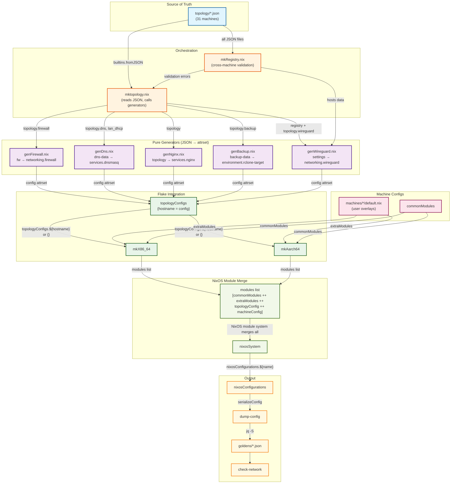

# Topology Generator Architecture

## Overview

The topology system transforms JSON configuration files into NixOS config attrsets using pure generators. This is the two-layer architecture: topology JSON is the single source of truth, generators are pure functions, and machine configs provide user-specific overlays.

## Architecture Diagram



## Legend

| Color | Component | Description |
|-------|-----------|-------------|
| 🔵 Blue | Source of Truth | Topology JSON files (`topology/*.json`) |
| 🟣 Purple | Pure Generators | JSON → config attrset functions |
| 🟠 Orange | Orchestration | `mktopology.nix` and helpers |
| 🟢 Green | Flake Integration | `topologyConfigs` and builders |
| 🔴 Pink | Machine Configs | User-specific overlays |
| 🟢 Light Green | NixOS Module Merge | Module system combines all sources |
| 🟡 Yellow | Output | `nixosConfigurations` and validation |

## Data Flow

### 1. Source of Truth
Topology JSON files in `topology/` contain all network topology data:
- Coordinates (interfaces, IPs, planes)
- WireGuard configuration
- Firewall rules
- DNS/DHCP entries
- Nginx vhosts
- Backup targets

### 2. Pure Generators
Each generator is a pure function that takes JSON data and produces a NixOS config attrset:

| Generator | Input | Output |
|-----------|-------|--------|
| `genFirewall.nix` | `topology.firewall` | `{ networking.firewall = {...}; }` |
| `genDns.nix` | `{dns, lan_dhcp}` | `{ services.dnsmasq = {...}; }` |
| `genNginx.nix` | `topology` | `{ services.nginx = {...}; }` |
| `genBackup.nix` | `topology.backup` | `{ environment.rclone-target = {...}; }` |
| `genWireguard.nix` | `settings` | `{ networking.wireguard = {...}; }` |

### 3. Orchestration
`mktopology.nix` reads all JSON files and calls generators:
- Imports all generators
- Reads JSON with `builtins.fromJSON`
- Calls generators conditionally (only if topology has the section)
- Returns `{ hostname = config attrset; }`

### 4. Flake Integration
`flake.nix` builds the modules list for each machine:
```nix
# In mkX86_64:
topologyConfig = topologyConfigs.${hostname} or {};
modules = commonModules ++ extraModules ++ [
  ./machines/${hostname}      # Machine-specific config
  topologyConfig              # Topology-generated config
  { ... }                     # Inline config
];
```

### 5. NixOS Module Merge
The NixOS module system merges all modules in the list:
- **commonModules** — shared across all machines (secrix, ratty, etc.)
- **extraModules** — machine-specific imports (users, services, etc.)
- **topologyConfig** — generated from topology JSON (firewall, DNS, nginx, etc.)
- **machineConfig** — from `machines/*/default.nix` (user overlays)

The merge order matters: later modules override earlier ones for simple options. For submodule options (like `services.nginx.virtualHosts`), the module system deep-merges.

### 6. Validation
Goldens verify the merged output:
- `dump-config` serializes the full NixOS config
- `check-network` compares against golden files
- Any mismatch blocks deployment

## Key Principles

1. **Generators are pure functions** — JSON in, attrset out, no module system
2. **Topology is the single source of truth** — all network config in JSON
3. **Machine config provides overlays** — user-specific settings, not topology
4. **Goldens are sacrosanct** — if check fails, code is wrong

## Migration Pattern

The topology system supports incremental migration from hand-written config to topology-driven config.

### Starting Point
A working NixOS configuration with hand-written services:
```nix
# machines/my-server/default.nix
services.nginx = {
  enable = true;
  virtualHosts."example.com" = {
    forceSSL = true;
    enableACME = true;
    locations."/".proxyPass = "http://10.0.0.1:8080";
  };
};
```

### Step 1: Create Topology JSON
Create `topology/my-server.json` with the topology-derived fields:
```json
{
  "hostname": "my-server",
  "coordinate": [...],
  "vhosts": {
    "example.com": [
      {
        "proxy_to": "10.0.0.1:8080",
        "acme": { "enable": true },
        "forceSSL": true
      }
    ]
  }
}
```

### Step 2: Remove from Machine Config
Remove the topology-derived fields from `machines/my-server/default.nix`:
```nix
# services.nginx = {                      # REMOVED — now in topology JSON
#   enable = true;
#   virtualHosts."example.com" = { ... };
# };
```

### Step 3: Add User Overlays (if needed)
If the service has user-specific settings not in topology, add as overlay:
```nix
# Machine-specific overlay (not topology-derived)
services.nginx.virtualHosts."example.com" = {
  extraConfig = "client_max_body_size 100M;";  # User-specific
};
```

### Step 4: Validate
```bash
nix run .#check-network -- my-server
```

### Migration Rules

| Field Type | In Topology? | In Machine Config? |
|------------|--------------|-------------------|
| Listen addresses | ✅ Yes | ❌ No |
| ForceSSL | ✅ Yes | ❌ No |
| ACME config | ✅ Yes | ❌ No |
| Proxy targets | ✅ Yes | ❌ No |
| Static roots | ✅ Yes (or machine) | ✅ Yes (if derivation) |
| Custom headers | ❌ No | ✅ Yes |
| Rate limits | ❌ No | ✅ Yes |
| Websocket config | ❌ No | ✅ Yes (usually) |
| Secret paths | ❌ No | ✅ Yes |

### What Goes in Topology JSON

**Topology-derived** (belongs in JSON):
- Network coordinates (IPs, interfaces, planes)
- WireGuard peers and config
- Firewall rules (ports, interfaces)
- DNS/DHCP entries
- Nginx vhost structure (listen, proxy, ACME, forceSSL)
- Backup targets (remote names, paths, schedules)
- Prometheus exporters (ports, listen addresses)

**User-specific** (belongs in machine config):
- Filesystem paths (webroot, data directories)
- Secret references (passwords, API keys)
- Custom nginx config (headers, rate limits, websockets)
- Service-specific options (database config, app settings)
- Hardware-specific config (GPU, disk layout)

## Files

| File | Purpose |
|------|---------|
| `topology/*.json` | Source of truth for each machine |
| `lib/topology/gen*.nix` | Pure generators |
| `lib/topology/mktopology.nix` | Orchestrator |
| `lib/topology/mkRegistry.nix` | Cross-machine validation |
| `flake.nix` | Wiring and integration |
| `machines/*/default.nix` | Machine-specific overlays |
| `goldens/*.json` | Validation reference |

## See Also

- `PRINCIPLE.md` — The architecture principle (stated in full)
- `AGENTS.md` — Build philosophy and constraints
- `documentation/development-guide.md` — Development workflow
