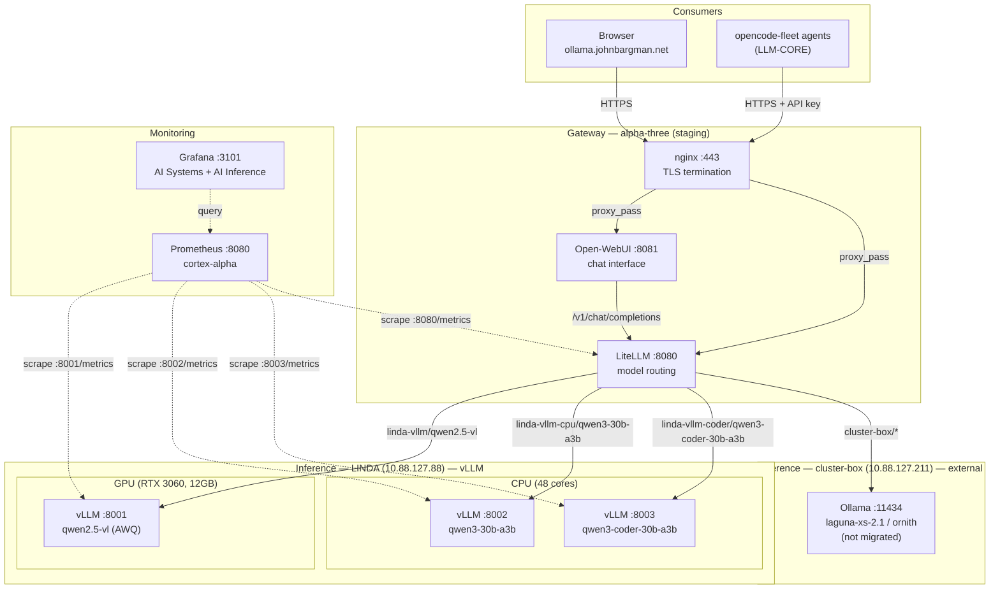

# vLLM-Only Architecture

**Status**: Implemented (Phases 1–5 complete; Phase 6 documentation in progress)  
**Target**: Replace Ollama with vLLM for all inference  
**Last updated**: 2026-08-25

> This document supersedes the original planning document (2026-08-24) and reflects
> the **actual implementation state**. Phase-by-phase execution status, deviations
> from plan, and lessons learned are documented below. The executable plan lives in
> `documentation/vllm-migration-plan.md`.

---

## Implementation Status

| Phase | Scope | Status |
|-------|-------|--------|
| 1 | Foundation — model packages + vLLM CPU support | ✅ Complete |
| 2 | Module enhancement — device assignment, model paths | ✅ Complete |
| 3 | Model migration — Ollama models → vLLM CPU | ✅ Complete |
| 4 | Monitoring — Prometheus scrape targets + dashboard | ✅ Complete |
| 5 | Cleanup — Ollama decommission, CUDA scoping, goldens | ✅ Complete |
| 6 | Documentation — ai-stack.md, vllm-architecture.md, ai-upgrades.md | 🔄 In progress (6.1, 6.2 done; 6.3 pending) |

Phases 1–5 were implemented on branch `ai/hardening-ii/vllm-authority`.
All golden tests for the 19 fleet machines were regenerated and validate.

---

## Vision

A single inference engine (vLLM) serving all models, with Nix managing models, configuration, and hardware assignment. One engine, one monitoring path, one configuration pattern.

**Implemented scope**: LINDA now serves all inference through vLLM — one GPU model and two CPU models, each in its own systemd service with weights from the Nix store. Ollama has been decommissioned on LINDA (`services/archive/ollama.nix`). cluster-box remains on Ollama — it is an external Malayalam flake outside the NixOS-Configuration migration boundary (see Deviations).

---

## Why vLLM-Only

| Advantage | Detail | Status |
|-----------|--------|--------|
| **Unified monitoring** | Full Prometheus metrics on every model — latency, throughput, queue depth, cache usage | ✅ Implemented (Phase 4) |
| **Native queuing** | Built-in scheduler handles concurrent requests without OOM | ✅ vLLM scheduler + `MemoryMax` per CPU service |
| **Declarative models** | Models managed by Nix, versioned in the store, validated at build time | ✅ `pkgs/models/*` pinned to commit SHAs |
| **Hardware assignment** | Per-model GPU/CPU assignment via systemd services | ✅ `device` option per model |
| **No GGUF dependency** | HuggingFace format only — no conversion, no Ollama registry | ✅ For migrated models (Laguna is the exception — see Deviations) |
| **Production proven** | Used by major inference providers, active development, enterprise support | ✅ |

---

## Architecture (as implemented)



### Routing (alpha-three LiteLLM)

| Backend | URL | Models |
|---------|-----|--------|
| `linda-vllm` | `http://10.88.127.88:8001/v1` | `qwen2.5-vl` (GPU, hosted_vllm) |
| `linda-vllm-cpu` | `http://10.88.127.88:8002/v1` | `qwen3-30b-a3b` (CPU, hosted_vllm) |
| `linda-vllm-coder` | `http://10.88.127.88:8003/v1` | `qwen3-coder-30b-a3b` (CPU, hosted_vllm) |
| `cluster-box` | `http://10.88.127.211:11434/v1` | laguna/ornith (Ollama, external — unchanged) |

The former `linda` Ollama backend (qwen3.8:27b, qwen3-coder:30b, laguna-s, laguna-xs on
:11434) has been removed. LiteLLM exposes `/metrics` via `callbacks = [ "prometheus" ]`.

---

## Nix-Managed Models (implemented)

### Model Store Integration

Models are stored in the Nix store, not downloaded at runtime. Each package is:
- **Reproducible**: pinned to a HuggingFace commit SHA (immutable revision)
- **Validated**: every file pinned to its own SRI sha256 — upstream changes fail the build instead of silently swapping weights
- **Versioned**: updates tracked in git
- **Cached**: store paths can be served by the planned in-house binary cache

### Package structure (`pkgs/models/`)

| File | Purpose |
|------|---------|
| `pkgs/models/default.nix` | Shared base builder (`files` fetchurl list and/or `src` fetchzip archive) |
| `pkgs/models/qwen3-8b.nix` | Qwen3-8B — reference/small-model example (Phase 1.2) |
| `pkgs/models/qwen3-30b-a3b.nix` | Qwen3-30B-A3B — CPU workhorse (replaces `qwen3.8:27b-q4_K_M` + `laguna-s-2.1:q4_K_M`) |
| `pkgs/models/qwen3-coder-30b-a3b.nix` | Qwen3-Coder-30B-A3B-Instruct — code model (replaces `qwen3-coder:30b-a3b-q4_K_M`) |

Exposed on the flake as `self.models.*` (flake.nix):

```nix
models = {
  qwen3-8b = nixpkgs.callPackage ./pkgs/models/qwen3-8b.nix { };
  qwen3-30b-a3b = nixpkgs.callPackage ./pkgs/models/qwen3-30b-a3b.nix { };
  qwen3-coder-30b-a3b = nixpkgs.callPackage ./pkgs/models/qwen3-coder-30b-a3b.nix { };
};
```

**Usage in a machine config** (LINDA):

```nix
services.vllm.models = [
  {
    name = "qwen3-30b-a3b";
    model = "Qwen/Qwen3-30B-A3B";
    modelPath = self.models.qwen3-30b-a3b;  # nix store, not runtime download
    servedModelName = "qwen3-30b-a3b";
    port = 8002;
    device = "cpu";
    dtype = "bfloat16";          # halves RAM vs float32 on AMD Zen
    cpuKvCacheSpace = 40;        # GiB
    cpuOmpThreadsBind = "0-29";  # pin OpenMP threads to 30 of 48 cores
  }
];
```

When `modelPath` is set, the module also pins `HF_HOME` to the cache dir
(`${cfg.cacheDir}/huggingface`) — no runtime HuggingFace access is needed.

### Obtaining hashes for a new model

```bash
nix store prefetch-file --json https://huggingface.co/Qwen/Qwen3-8B/resolve/main/model.safetensors
# Use the `.hash` field (SRI sha256) in the package's `files` list.
```

---

## Hardware Assignment (implemented in `modules/vllm.nix`)

### Per-model options

```nix
device = "gpu" | "cpu";            # default "gpu"
modelPath = null | path;           # nix store path (overrides model ID)
cpuKvCacheSpace = 4;               # GiB, CPU only
cpuOmpThreadsBind = "auto";        # e.g. "0-29"
```

### GPU model service

- `CUDA_VISIBLE_DEVICES` = configured value (LINDA: `"0"` — RTX 3060 only)
- Args: `--tensor-parallel-size N --gpu-memory-utilization 0.8`
- No `MemoryMax` (VRAM bound, not RAM)

### CPU model service

- `CUDA_VISIBLE_DEVICES=""` (no GPU access)
- `VLLM_CPU_KVCACHE_SPACE` = `cpuKvCacheSpace` (GiB)
- `VLLM_CPU_OMP_THREADS_BIND` = `cpuOmpThreadsBind`
- Args: `--device cpu` (no tensor-parallel / gpu-memory-utilization flags — those are GPU-only)
- `MemoryMax = "80%"` on the systemd unit — caps host RAM (weights + KV cache live in RAM)

### LINDA deployment

| Model | Device | Port | VRAM/RAM notes |
|-------|--------|------|----------------|
| `qwen2.5-vl` (Qwen2.5-VL-7B-Instruct-AWQ) | GPU 0 (RTX 3060) | 8001 | ~5 GB VRAM, `gpuMemoryUtilization = 0.8`, prefix caching, `max-num-seqs 16` |
| `qwen3-30b-a3b` (Qwen3-30B-A3B) | CPU | 8002 | 40 GiB KV cache bfloat16, 30 cores bound |
| `qwen3-coder-30b-a3b` (Qwen3-Coder-30B-A3B-Instruct) | CPU | 8003 | 40 GiB KV cache bfloat16, 30 cores bound |

LINDA specifics:
- `host = "0.0.0.0"` (expose on WireGuard plane), `openFirewall = true`
- `cacheDir = "/speed-storage/vllm-cache"` (ZFS; survives restarts — see Lessons Learned)
- `nix.gc.automatic = false` — never garbage-collect the model store / cache

---

## Request Queuing

### vLLM Scheduler

vLLM's scheduler handles queuing natively (as planned): `max_num_seqs`,
`max_num_batched_tokens`, preemption, waiting queue. LINDA sets
`--max-num-seqs 16` on the GPU model; CPU models use vLLM defaults.

### LiteLLM Queuing

`services/litellm.nix` configures gateway-level behavior via
`litellm_settings`: `drop_params`, `num_retries`, `request_timeout`,
`fallbacks`, and (new in this migration) `callbacks = [ "prometheus" ]`.
The original plan's `router_settings` example (`routing_strategy = "least-busy"`,
`allowed_fails`, `cooldown_time`) was **not implemented** — those were
aspirational and no per-router settings option exists in the module.
vLLM's native scheduler remains the primary queue; LiteLLM adds retries,
timeouts, and optional fallback groups.

---

## Monitoring (implemented, Phase 4)

### Prometheus scrape targets (`services/prometheus.nix`)

| Job | Targets | Labels |
|-----|---------|--------|
| `vllm-gpu` | `10.88.127.88:8001` | hostname=LINDA, device=gpu, model=qwen2.5-vl |
| `vllm-cpu` | `10.88.127.88:8002` | hostname=LINDA, device=cpu, model=qwen3-30b-a3b |
| `vllm-cpu-coder` | `10.88.127.88:8003` | hostname=LINDA, device=cpu, model=qwen3-coder-30b-a3b |
| `litellm` | `10.88.127.107:8080` | hostname=alpha-three, role=gateway |

LiteLLM `/metrics` is enabled via `services.litellm.callbacks = [ "prometheus" ]`
(alpha-three). The original plan called for Bearer auth on the litellm scrape —
the implemented target scrapes without credentials (the module exposes /metrics
unauthenticated on the WireGuard plane; revisit if the gateway moves off-site).

### Grafana

- `services/graphana_dashboards/ai-systems.json` — hardware (existing)
- `services/graphana_dashboards/ai-inference.json` — NEW: request rate, latency
  (p50/p95/p99), queue depth, KV cache usage, error rate, token throughput by
  model, LiteLLM deployment state

### Alerting rules

**Not yet implemented.** Prometheus scrapes all inference services, but no
alerting rules exist for KV cache pressure, queue depth, GPU temp/VRAM, or
gateway health. Deferred — see Next Steps.

---

## Migration Path — Execution Report

### Phase 1: Foundation ✅

- **1.1** `pkgs/models/default.nix` template (per-file fetchurl + fetchzip src patterns, `dontUnpack`/`dontFixup`, required-file sanity check) — commit `dbf2ca7`
- **1.2** `pkgs/models/qwen3-8b.nix` — builds; files verified
- **1.3** vLLM CPU inference validated via the extended module (CPU backend flags, env vars) — superseded by the Phase 2 module work rather than a standalone test harness

### Phase 2: Module Enhancement ✅

- **2.1** `device`, `modelPath`, `cpuKvCacheSpace`, `cpuOmpThreadsBind` options added to `modules/vllm.nix` (module grew 392 → 524 lines)
- **2.2** CPU service generation: env vars (`VLLM_CPU_KVCACHE_SPACE`, `VLLM_CPU_OMP_THREADS_BIND`, blank `CUDA_VISIBLE_DEVICES`), `MemoryMax = "80%"`, `--device cpu` args
- **2.3** CPU models deployed on LINDA (:8002 qwen3-30b-a3b, :8003 qwen3-coder)

### Phase 3: Model Migration ✅

- **3.1** `pkgs/models/qwen3-30b-a3b.nix` (16 shards, pinned `ad44e77` rev)
- **3.2** `pkgs/models/qwen3-coder-30b-a3b.nix` — commit `bc90114`
- **3.3** LINDA: Ollama removed, LiteLLM backends rewritten to `linda-vllm-cpu` / `linda-vllm-coder`; topology firewall port 11434 dropped; `.ollama/**` removed from backup excludes

### Phase 4: Monitoring ✅

- **4.1** vLLM scrape targets (:8001/:8002/:8003) with hostname/device/model labels
- **4.2** LiteLLM `/metrics` via `callbacks = [ "prometheus" ]` + scrape target
- **4.3** `ai-inference.json` Grafana dashboard

### Phase 5: Cleanup ✅

- **5.1** `services/ollama.nix` archived to `services/archive/ollama.nix`; no Ollama references remain in LINDA config; `modifier_imports/cuda.nix` drops `unstable.ollama-cuda`
- **5.2** CUDA scoping: global `cudaSupport = true` replaced by a scoped `pkgsCuda` overlay in flake.nix — only `vllm` is rebuilt with CUDA (CUDA torch + flashinfer); `config.problems.handlers.*.broken = "warn"` for CUDA-only deps; no duplicate nixpkgs imports. The overlay uses `python313Packages.overrideScope` to rebuild **torch and every torch-dependent package in the scoped set** (torchaudio, torchvision, xformers, triton) against the CUDA torch. A plain `vllm.override { cudaSupport = true; torch = ...; }` is NOT sufficient: vllm's transitive deps would stay bound to the CPU torch, both torches would land in the build env, and cmake's `find_package(Torch)` would pick the CPU `TorchConfig.cmake` (`CAFFE2_USE_CUDA=OFF`) → `CUDA_FOUND` never set → "Can't find CUDA or HIP installation."
- **5.3** Open-WebUI `pkgsNoCuda` duplicate-import workaround replaced with `pkgs.python3Packages.overrideScope` forcing `torch.cudaSupport = false` in-place (no second nixpkgs import; stable CPU binaries used)
- **5.4** All 19 fleet goldens regenerated (topology wiring, firewall, module option defaults) and validated

---

## Deviations from Plan

1. **cluster-box NOT migrated** — external Malayalam flake (dlyon-operated). Ollama
   on :11434 stays; `cluster-box/*` LiteLLM backend unchanged. Migration boundary
   is NixOS-Configuration machines only.
2. **Laguna models NOT migrated** — laguna-s / laguna-xs are custom GGUF models with
   **no HuggingFace safetensors release**. On LINDA they are replaced by
   Qwen3-30B-A3B (HF, Apache-2.0). cluster-box still serves the originals.
3. **Qwen3-Coder repo name** — plan said `Qwen/Qwen3-Coder-30B-A3B`; the official
   HF repo is `Qwen/Qwen3-Coder-30B-A3B-Instruct` (the bare `-A3B` repo does not
   exist). Corrected in package and LINDA config.
4. **Phase 1 verification criteria corrected** — original criteria said "no changes
   to vLLM module or LINDA config", which conflicted with the CPU-support work;
   fixed in commit `4da39c5`.
5. **CUDA scoping approach** — plan anticipated a `pkgsCuda` overlay *or*
   package-level overrides; implemented as a `pkgsCuda` overlay on a fresh
   `nixpkgs_llm` import (CUDA vLLM only), replacing the old
   `config.cudaSupport = true` import entirely. The first implementation only
   overrode `vllm` + `torch` at the vllm level and failed with "Can't find CUDA
   or HIP installation" — the fix requires `overrideScope` on
   `python313Packages` so the CUDA torch propagates to ALL torch-dependent
   packages, plus `triton = prev.python313Packages.triton-cuda` (referenced
   from the outer scope to avoid `self.triton.override` recursion) so packages
   depending on both torch and triton (e.g. xgrammar) don't hit a
   duplicate-package closure conflict.
6. **Open-WebUI workaround** — plan offered "remove pkgsNoCuda or document it";
   implemented a better fix: `overrideScope` on python3Packages to force CPU-only
   torch, eliminating the duplicate nixpkgs import.
7. **Model packages pin commit SHAs** — the template's default `rev = "main"` is
   overridden by every real package with an immutable commit SHA + per-file SRI
   hashes (stronger than the plan's branch-based fetch).
8. **LiteLLM scrape auth** — plan called for Bearer-token auth on the litellm
   Prometheus target; implemented unauthenticated (see Monitoring).
9. **Benchmark vs Ollama not completed** — CPU migration shipped without a
   formal Ollama-vs-vLLM CPU benchmark (see Open Questions #3).

---

## Lessons Learned

1. **Global `cudaSupport = true` is a footgun.** It cascades CUDA into every
   package on the machine (torch, ollama, blender…). Scope CUDA with an overlay
   that rebuilds only the packages that need it. Also expect upstream
   `broken = true` markers on CUDA vLLM deps — handle them explicitly.
2. **`PrivateTmp` destroys the torch.compile cache.** torchinductor writes cubin
   files to `/tmp/torchinductor_root`; `PrivateTmp = true` wiped them on restart,
   causing "Cubin file not found" crashes. Disabled `PrivateTmp`; LINDA's `/tmp`
   is ZFS (`speed-storage/tmp`) so persistence is safe. `TORCHINDUCTOR_CACHE_DIR`
   also persists the cache under `cfg.cacheDir`.
3. **Per-file SRI hashes + pinned commit SHA make model packages immutable.**
   A moving branch would silently swap weights; per-file hashes fail the build
   instead. `dontUnpack`/`dontFixup` avoid the reference scanner over multi-GB
   binary weight files.
4. **Verify HF repo names before pinning.** `Qwen3-Coder-30B-A3B` (no `-Instruct`)
   does not exist. Always confirm the exact repo and revision.
5. **CPU vLLM is a different flag set.** `--device cpu`, `VLLM_CPU_KVCACHE_SPACE`,
   `VLLM_CPU_OMP_THREADS_BIND`; GPU-only flags (`--tensor-parallel-size`,
   `--gpu-memory-utilization`) must be conditionally omitted.
6. **`bfloat16` halves CPU RAM vs float32** on AMD Zen — important for 30B-class
   CPU models with multi-GiB KV caches. `MemoryMax = "80%"` per CPU service is the
   host protection (weights + KV cache are RAM-resident).
7. **Avoid duplicate nixpkgs imports.** The old `pkgsNoCuda = import pkgs.path`
   workaround was replaced by `python3Packages.overrideScope` — same result
   (CPU-only torch for open-webui), one nixpkgs instance, no full second eval.
8. **MoE models are the CPU sweet spot.** Qwen3-30B-A3B has 3B active params —
   the 30B MoE class runs reasonably on CPU, making it the natural replacement
   for the old Ollama 27B/33B CPU models.

---

## Open Questions — Resolved

1. **Laguna models: on HuggingFace?** → **Resolved: no.** laguna-s/laguna-xs are
   custom GGUF with no HF safetensors release. LINDA migrated to Qwen3-30B-A3B
   (HF, Apache-2.0). cluster-box still serves the originals via Ollama (external).
   Open sub-question: convert GGUF→HF or replace — deferred, requires Malayalam
   owner coordination.
2. **HF model size vs GGUF / disk space?** → **Resolved.** bfloat16 safetensors are
   larger than q4 GGUF, but LINDA's store is ZFS-backed (`speed-storage`) and
   `nix.gc.automatic = false` prevents collection. Two 30B CPU models + 8B
   reference fit comfortably.
3. **vLLM CPU performance vs Ollama?** → **Partially resolved.** The 3B-active MoE
   design (30B-A3B) is CPU-viable and deployed. A formal head-to-head benchmark
   against the decommissioned Ollama setup was **not completed** before removal —
   recorded as a current limitation in `documentation/ai-stack.md`.
4. **Right `MemoryMax` for CPU models?** → **Resolved.** `80%` per CPU model
   service, implemented as the module default for `device = "cpu"`.
5. **Model updates?** → **Resolved.** Bump `rev` to a new HF commit SHA and refresh
   each file's SRI hash (`nix store prefetch-file --json`), then rebuild. The
   version bump is a normal Nix store change; goldens capture the resulting config.

---

## Next Steps

1. **Alerting rules** — KV cache pressure, queue depth, GPU temp/VRAM, LiteLLM
   backend health (metrics already scraped; rules not yet written)
2. **Benchmark CPU inference** — Qwen3-30B-A3B vs the old Ollama numbers (record
   TTFT / tok/s for the record)
3. **Laguna resolution** — convert GGUF→HF or formally replace laguna-xs on
   cluster-box (coordinate with dlyon)
4. **cluster-box vLLM migration** — bring the Malayalam models into NixOS-Configuration
5. **Step 6.3** — update `documentation/ai-upgrades.md` to mark P1–P5 resolved
6. **README reference check** — ensure docs index points at the vLLM-only documents

---

*Document status: Implementation-complete (Phase 6 in progress)*  
*Engineer: bellana-deepseek*  
*Verification: tpol-minimax*
