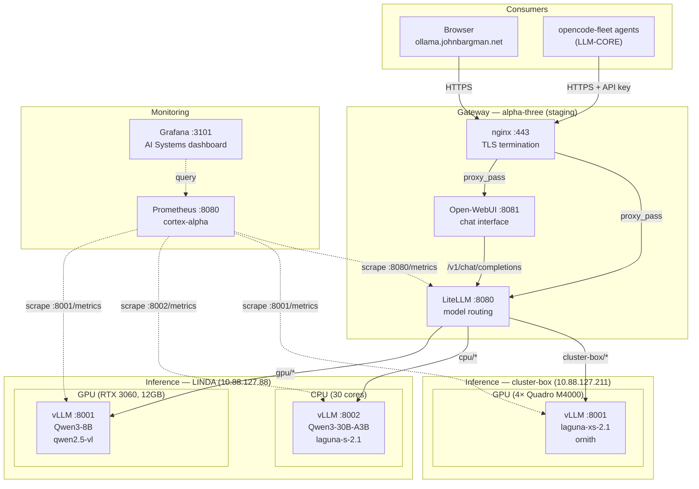

# vLLM-Only Architecture — Planning Document

**Status**: Planning  
**Target**: Replace Ollama with vLLM for all inference  
**Last updated**: 2026-08-24

---

## Vision

A single inference engine (vLLM) serving all models, with Nix managing models, configuration, and hardware assignment. One engine, one monitoring path, one configuration pattern.

---

## Why vLLM-Only

| Advantage | Detail |
|-----------|--------|
| **Unified monitoring** | Full Prometheus metrics on every model — latency, throughput, queue depth, cache usage |
| **Native queuing** | Built-in scheduler handles concurrent requests without OOM |
| **Declarative models** | Models managed by Nix, versioned in the store, validated at build time |
| **Hardware assignment** | Per-model GPU/CPU assignment via systemd services |
| **No GGUF dependency** | HuggingFace format only — no conversion, no Ollama registry |
| **Production proven** | Used by major inference providers, active development, enterprise support |

---

## Architecture



---

## Nix-Managed Models

### Model Store Integration

Models are stored in the Nix store, not downloaded at runtime. This means:

- **Reproducible**: Same model version across all deployments
- **Validated**: Model integrity checked at build time
- **Versioned**: Model updates are tracked in git
- **Cached**: Binary cache can serve pre-downloaded models

### Model Package Structure

```nix
# pkgs/models/qwen3-8b.nix
{ stdenv, fetchurl }:

stdenv.mkDerivation {
  pname = "qwen3-8b";
  version = "2507";
  
  src = fetchurl {
    url = "https://huggingface.co/Qwen/Qwen3-8B/resolve/main/model.safetensors";
    hash = "sha256-...";
  };
  
  # Additional files: config.json, tokenizer.json, etc.
  
  installPhase = ''
    mkdir -p $out
    cp -r $src/* $out/
  '';
  
  meta = {
    description = "Qwen3-8B language model";
    homepage = "https://huggingface.co/Qwen/Qwen3-8B";
    license = "apache-2.0";
  };
}
```

### Model Configuration in Nix

```nix
# modules/vllm.nix — model registration
{
  services.vllm = {
    enable = true;
    models = [
      {
        name = "qwen3-8b-gpu";
        model = "Qwen/Qwen3-8B";
        port = 8001;
        device = "gpu";  # or "cpu"
        gpuMemoryUtilization = 0.8;
        maxModelLen = "32768";
        # Model source: nix store path
        modelPath = pkgs.models.qwen3-8b;
      }
      {
        name = "laguna-s-cpu";
        model = "Qwen/Qwen3-30B-A3B";
        port = 8002;
        device = "cpu";
        cpuKvCacheSpace = 40;  # GiB
        maxModelLen = "262144";
        modelPath = pkgs.models.laguna-s-2.1;
      }
    ];
  };
}
```

---

## Hardware Assignment

### GPU Models

```nix
{
  name = "qwen3-8b-gpu";
  device = "gpu";
  cudaVisibleDevices = "0";  # RTX 3060 only
  gpuMemoryUtilization = 0.8;
  tensorParallelSize = 1;
}
```

**Systemd service**:
- Binds to GPU 0 via `CUDA_VISIBLE_DEVICES`
- `gpuMemoryUtilization` controls VRAM allocation
- `max_num_seqs` controls batch size
- Metrics on `/metrics` endpoint

### CPU Models

```nix
{
  name = "laguna-s-cpu";
  device = "cpu";
  cpuKvCacheSpace = 40;  # GiB
  cpuOmpThreadsBind = "0-29";  # Reserve 1 core for framework
  dtype = "bfloat16";  # Required for AMD Zen
}
```

**Systemd service**:
- No GPU access (`CUDA_VISIBLE_DEVICES=""`)
- `VLLM_CPU_KVCACHE_SPACE` controls KV cache size
- `VLLM_CPU_OMP_THREADS_BIND` controls CPU affinity
- Metrics on `/metrics` endpoint

### Mixed Hardware (LINDA)

```nix
# GPU model on port 8001
{
  name = "qwen2.5-vl";
  model = "Qwen/Qwen2.5-VL-7B-Instruct-AWQ";
  port = 8001;
  device = "gpu";
  cudaVisibleDevices = "0";
  gpuMemoryUtilization = 0.8;
  maxModelLen = "8192";
}

# CPU model on port 8002
{
  name = "laguna-s";
  model = "Qwen/Qwen3-30B-A3B";
  port = 8002;
  device = "cpu";
  cpuKvCacheSpace = 40;
  cpuOmpThreadsBind = "0-29";
  dtype = "bfloat16";
}
```

Both run concurrently. LiteLLM routes by model prefix:
- `gpu/qwen2.5-vl` → port 8001
- `cpu/laguna-s` → port 8002

---

## Request Queuing

### vLLM Scheduler

vLLM's scheduler handles queuing natively:

- **`max_num_seqs`**: Max sequences in a batch (default 128 online, 256 offline)
- **`max_num_batched_tokens`**: Max tokens in a batch (default 2048 online, 4096 offline)
- **Preemption**: Higher-priority requests can preempt lower-priority ones
- **Waiting queue**: Requests queue when the batch is full

### Metrics

The scheduler exposes queue metrics:

- `vllm:num_requests_running` — currently executing
- `vllm:num_requests_waiting` — queued, waiting for batch slot
- `vllm:request_queue_time_seconds` — time spent in queue
- `vllm:kv_cache_usage_perc` — KV cache utilization

### LiteLLM Queuing

LiteLLM adds a second layer of queuing:

```nix
router_settings = {
  routing_strategy = "least-busy";  # Route to least loaded backend
  num_retries = 3;
  timeout = 300;  # 5 minutes for long inference
  allowed_fails = 3;  # Circuit breaker
  cooldown_time = 30;  # Seconds
};
```

---

## Monitoring

### Prometheus Scrape Targets

```nix
# services/prometheus.nix
{
  job_name = "vllm-gpu";
  scrape_interval = "5s";
  static_configs = [{
    targets = [ "10.88.127.88:8001" ];
    labels = { hostname = "LINDA"; device = "gpu"; };
  }];
}
{
  job_name = "vllm-cpu";
  scrape_interval = "5s";
  static_configs = [{
    targets = [ "10.88.127.88:8002" ];
    labels = { hostname = "LINDA"; device = "cpu"; };
  }];
}
{
  job_name = "litellm";
  scrape_interval = "10s";
  static_configs = [{
    targets = [ "10.88.127.107:8080" ];
    labels = { hostname = "alpha-three"; role = "gateway"; };
  }];
  authorization = {
    type = "Bearer";
    credentials = "sk-...";  # From secrix
  };
}
```

### Key Metrics

| Metric | Type | Purpose |
|--------|------|---------|
| `vllm:num_requests_running` | Gauge | Current batch size |
| `vllm:num_requests_waiting` | Gauge | Queue depth |
| `vllm:kv_cache_usage_perc` | Gauge | VRAM/RAM pressure |
| `vllm:time_to_first_token_seconds` | Histogram | TTFT latency |
| `vllm:e2e_request_latency_seconds` | Histogram | End-to-end latency |
| `vllm:prompt_tokens_total` | Counter | Input throughput |
| `vllm:generation_tokens_total` | Counter | Output throughput |
| `litellm_proxy_total_requests_metric` | Counter | Gateway request rate |
| `litellm_deployment_state` | Gauge | Backend health (0/1/2) |
| `litellm_request_total_latency_metric` | Histogram | Gateway latency |

### Alerting Rules

```yaml
# Example Prometheus alerting rules
groups:
  - name: vllm
    rules:
      - alert: VLLMHighKVCacheUsage
        expr: vllm:kv_cache_usage_perc > 0.9
        for: 5m
        labels:
          severity: warning
        annotations:
          summary: "vLLM KV cache usage above 90%"

      - alert: VLLMHighQueueDepth
        expr: vllm:num_requests_waiting > 10
        for: 2m
        labels:
          severity: warning
        annotations:
          summary: "vLLM queue depth above 10"

      - alert: LiteLLMBackendDown
        expr: litellm_deployment_state == 2
        for: 1m
        labels:
          severity: critical
        annotations:
          summary: "LiteLLM backend is down"
```

---

## Migration Path

### Phase 1: Parallel Running

Run vLLM alongside Ollama. Migrate models one at a time.

1. Deploy vLLM with GPU model (Qwen2.5-VL)
2. Verify metrics and queuing
3. Migrate CPU models from Ollama to vLLM
4. Verify each migration
5. Decommission Ollama

### Phase 2: Model Format Migration

Convert GGUF models to HuggingFace format:

| Current (Ollama) | Target (vLLM) | Notes |
|-------------------|---------------|-------|
| qwen3.8:27b-q4_K_M | Qwen/Qwen3-27B | HF format, AWQ quantization |
| qwen3-coder:30b-a3b-q4_K_M | Qwen/Qwen3-30B-A3B | HF format, AWQ quantization |
| laguna-s-2.1:q4_K_M | Qwen/Qwen3-30B-A3B | HF format, AWQ quantization |
| laguna-xs-2.1:q4_K_M | Qwen/Qwen3-30B-A3B | HF format, AWQ quantization |

**Note**: Laguna models are custom. Need to verify HF availability or convert.

### Phase 3: Nix Store Models

1. Create `pkgs/models/` directory
2. Add model packages for each model
3. Update vLLM module to accept `modelPath`
4. Test model loading from nix store
5. Update golden tests

---

## Module Changes

### vLLM Module Updates

The existing `modules/vllm.nix` needs these additions:

```nix
# New options for hardware assignment
device = lib.mkOption {
  type = lib.types.enum [ "gpu" "cpu" ];
  default = "gpu";
  description = "Device to run inference on";
};

cpuKvCacheSpace = lib.mkOption {
  type = lib.types.int;
  default = 4;
  description = "CPU KV cache size in GiB";
};

cpuOmpThreadsBind = lib.mkOption {
  type = lib.types.str;
  default = "auto";
  description = "CPU core binding for OpenMP threads";
};

modelPath = lib.mkOption {
  type = lib.types.nullOr lib.types.path;
  default = null;
  description = "Path to model in nix store (overrides model download)";
};
```

### Systemd Service Generation

```nix
# GPU model service
systemd.services."vllm-${modelCfg.name}" = {
  environment = {
    CUDA_VISIBLE_DEVICES = modelCfg.cudaVisibleDevices;
    VLLM_CPU_KVCACHE_SPACE = if modelCfg.device == "cpu" 
      then toString modelCfg.cpuKvCacheSpace 
      else null;
    VLLM_CPU_OMP_THREADS_BIND = if modelCfg.device == "cpu" 
      then modelCfg.cpuOmpThreadsBind 
      else null;
  };
  serviceConfig.ExecStart = "${lib.getExe' cfg.package "vllm"} serve ${modelPath} ${args}";
};

# CPU model needs MemoryMax
systemd.services."vllm-${modelCfg.name}".serviceConfig.MemoryMax = 
  if modelCfg.device == "cpu" then "80%" else null;
```

---

## Open Questions

1. **Laguna models**: Are they available on HuggingFace, or do we need to convert from GGUF?
2. **Model size**: HF models are larger than GGUF. Do we have enough disk space in the nix store?
3. **CPU performance**: Is vLLM CPU inference fast enough for our use case? Need benchmarking.
4. **Memory limits**: What's the right `MemoryMax` for CPU models? Need testing.
5. **Model updates**: How do we handle model updates? Rebuild the nix package?

---

## Next Steps

1. **Benchmark vLLM CPU** — Test Qwen3-30B-A3B on CPU, compare to Ollama
2. **Verify Laguna availability** — Check if Laguna models are on HuggingFace
3. **Prototype model package** — Create `pkgs/models/qwen3-8b.nix`
4. **Test mixed hardware** — Deploy GPU + CPU vLLM services on LINDA
5. **Update monitoring** — Add vLLM scrape targets to Prometheus

---

*Document status: Planning — pending implementation decisions*
