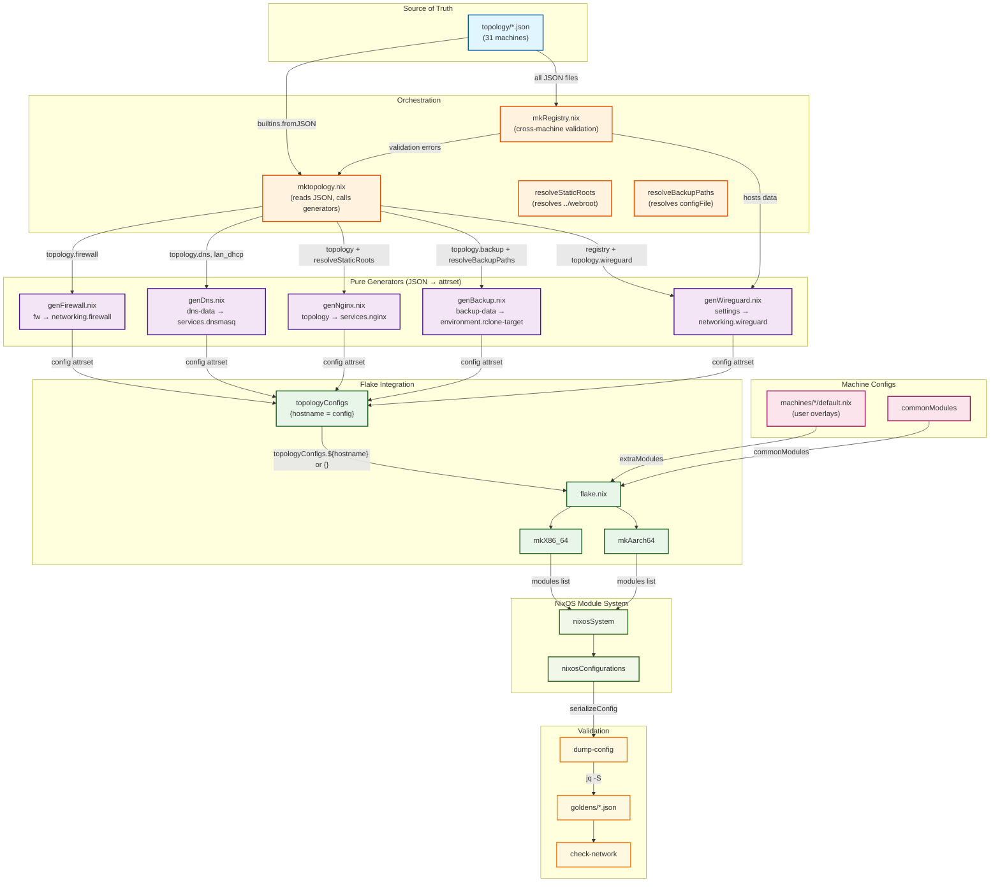

# Topology Generator Architecture

## Overview

The topology system transforms JSON configuration files into NixOS config attrsets using pure generators. This is the two-layer architecture: topology JSON is the single source of truth, generators are pure functions, and machine configs provide user-specific overlays.

## Architecture Diagram

## Legend

| Color | Component | Description |
|-------|-----------|-------------|
| 🔵 Blue | Source of Truth | Topology JSON files (`topology/*.json`) |
| 🟣 Purple | Pure Generators | JSON → config attrset functions |
| 🟠 Orange | Orchestration | `mktopology.nix` and helpers |
| 🟢 Green | Flake Integration | `flake.nix` and `topologyConfigs` |
| 🔴 Pink | Machine Configs | User-specific overlays |
| 🟢 Light Green | NixOS Module System | `nixosConfigurations` |
| 🟡 Yellow | Validation | Goldens and checks |

## Data Flow

### 1. Source of Truth
Topology JSON files in `topology/` contain all network topology data:
- Coordinates (interfaces, IPs, planes)
- WireGuard configuration
- Firewall rules
- DNS/DHCP entries
- Nginx vhosts
- Backup targets

### 2. Pure Generators
Each generator is a pure function that takes JSON data and produces a NixOS config attrset:

| Generator | Input | Output |
|-----------|-------|--------|
| `genFirewall.nix` | `topology.firewall` | `{ networking.firewall = {...}; }` |
| `genDns.nix` | `{dns, lan_dhcp}` | `{ services.dnsmasq = {...}; }` |
| `genNginx.nix` | `topology` | `{ services.nginx = {...}; }` |
| `genBackup.nix` | `topology.backup` | `{ environment.rclone-target = {...}; }` |
| `genWireguard.nix` | `settings` | `{ networking.wireguard = {...}; }` |

### 3. Orchestration
`mktopology.nix` reads all JSON files and calls generators:
- Imports all generators
- Reads JSON with `builtins.fromJSON`
- Calls generators conditionally (only if topology has the section)
- Resolves filesystem paths (static roots, backup configs)
- Returns `{ hostname = config attrset; }`

### 4. Flake Integration
`flake.nix` merges topology config with machine config:
- `topologyConfigs` = output of `mktopology`
- `mkX86_64`/`mkAarch64` merge `topologyConfigs.${hostname} or {}` into modules list
- Machine config provides user-specific overlays (extra modules, settings)

### 5. NixOS Module System
The module system merges all sources:
- Topology-generated config (from generators)
- Machine-specific config (from `machines/*/default.nix`)
- Common modules (from `commonModules`)
- Produces final `nixosConfigurations`

### 6. Validation
Goldens verify the merged output:
- `dump-config` serializes the full NixOS config
- `check-network` compares against golden files
- Any mismatch blocks deployment

## Key Principles

1. **Generators are pure functions** — JSON in, attrset out, no module system
2. **Topology is the single source of truth** — all network config in JSON
3. **Machine config provides overlays** — user-specific settings, not topology
4. **Goldens are sacrosanct** — if check fails, code is wrong

## Files

| File | Purpose |
|------|---------|
| `topology/*.json` | Source of truth for each machine |
| `lib/topology/gen*.nix` | Pure generators |
| `lib/topology/mktopology.nix` | Orchestrator |
| `lib/topology/mkRegistry.nix` | Cross-machine validation |
| `flake.nix` | Wiring and integration |
| `machines/*/default.nix` | Machine-specific overlays |
| `goldens/*.json` | Validation reference |

## See Also

- `PRINCIPLE.md` — The architecture principle (stated in full)
- `AGENTS.md` — Build philosophy and constraints
- `documentation/development-guide.md` — Development workflow
